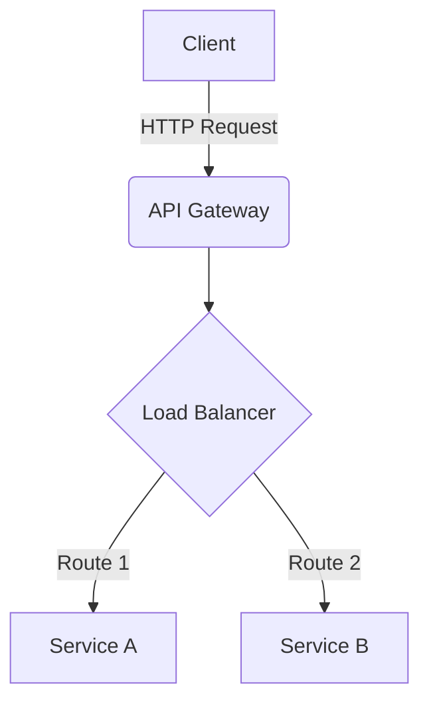
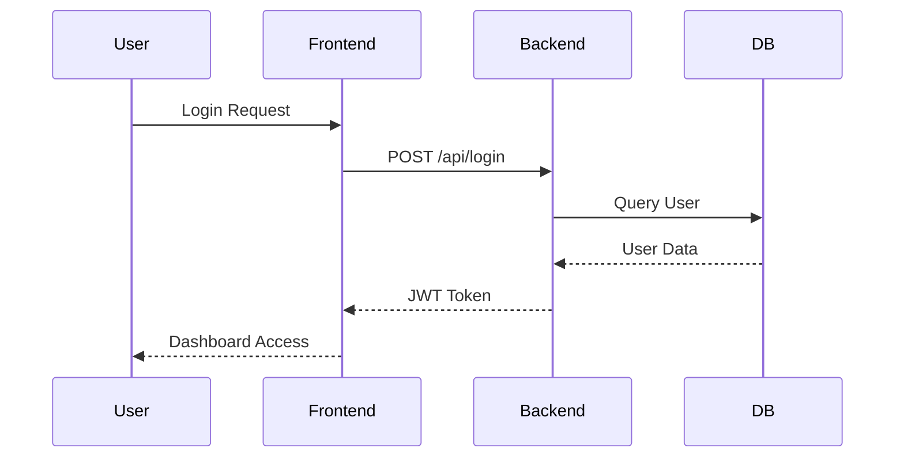

# System Architect Skill

## Description
This skill provides the agent with best practices for generating Mermaid.js diagrams and system architecture documentation.

## Guidelines for Drawing Diagrams

### Flowcharts
Use `graph TD` for top-down or `graph LR` for left-right flowcharts.

### Sequence Diagrams
Use `sequenceDiagram` for mapping out interactions between microservices.

## Instructions for the Agent
1. When asked to document a project, search the repository using the `ls` and `glob` tools to find key entry points (`main.py`, `app.ts`, `docker-compose.yaml`, etc.).
2. Understand the components by reading the core files.
3. Generate a comprehensive `ARCHITECTURE.md` file using the Mermaid templates above.
4. Always double-check Mermaid syntax to ensure the markdown renders correctly in standard viewers.
