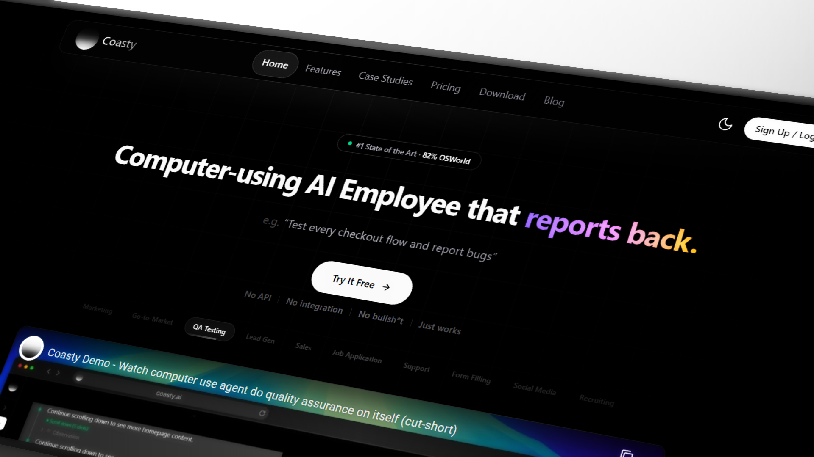

<div align="center">



<br />

# Open Computer Use

**AI agents that control computers like humans do.**

Browser automation · Terminal access · Desktop control · Multi-agent orchestration

<br />

[Website](https://coasty.ai) · [Discord](https://discord.gg/gppEfsVt) · [Twitter](https://x.com/llmhub_dev)

<br />

[](LICENSE)
[](http://makeapullrequest.com)

</div>

<br />

---

<br />

## See it in action

<table>
<tr>
<td align="center" width="50%">
<a href="https://www.youtube.com/watch?v=icxgLDephHE">

</a>
<br />
<strong>Marketing</strong> — Market your product on Reddit autonomously
<br />
<a href="https://coasty.ai/share/373c1f67-afec-4bd6-adda-3809ecdbdd75"><sub>View chat session</sub></a>
</td>
<td align="center" width="50%">
<a href="https://www.youtube.com/watch?v=qTvmGfg3HVw">

</a>
<br />
<strong>Go-to-Market</strong> — Find prospects and send personalized emails
<br />
<a href="https://coasty.ai/share/425d3c49-3a06-41e5-9859-aa00c5b12f3d"><sub>View chat session</sub></a>
</td>
</tr>
<tr>
<td align="center">
<a href="https://www.youtube.com/watch?v=Wbo2o74hVIo">

</a>
<br />
<strong>QA Testing</strong> — Test every checkout flow and report bugs
<br />
<a href="https://coasty.ai/share/7ee3e942-c5dd-4e49-93b6-353bb5273b7e"><sub>View chat session</sub></a>
</td>
<td align="center">
<a href="https://www.youtube.com/watch?v=mH-csaCa508">

</a>
<br />
<strong>Job Application</strong> — Find roles, tailor your resume, and apply
<br />
<a href="https://coasty.ai/share/4ac6f3d2-c273-4a07-bf98-b986d1cbfb88"><sub>View chat session</sub></a>
</td>
</tr>
<tr>
<td align="center">
<a href="https://www.youtube.com/watch?v=AnHJuRMLCnE">

</a>
<br />
<strong>Form Filling</strong> — Fill out the YC S26 application for you
<br />
<a href="https://coasty.ai/share/60a0722b-fb98-43d6-a4e7-951d80a22363"><sub>View chat session</sub></a>
</td>
<td align="center">
<a href="https://www.youtube.com/watch?v=A_OvNh51Npg">

</a>
<br />
<strong>Social Media</strong> — Post on Hacker News and engage with comments
<br />
<a href="https://coasty.ai/share/d181de46-b41d-4b87-9648-0374b2b7ec1c"><sub>View chat session</sub></a>
</td>
</tr>
</table>

<br />

---

<br />

## What is this?

Open Computer Use is an open-source platform that gives AI agents real computer control. Unlike chatbots that only *talk* about tasks, agents here **actually perform them** — browsing the web, running commands, clicking through UIs, and orchestrating multi-step workflows.

> Computer use capabilities similar to Anthropic's Claude Computer Use, but fully open-source and extensible.

<br />

---

<br />

## Agents

**Browser** — Search-first web navigation, form filling, element interaction, multi-tab management, screenshot capture.

**Terminal** — Command execution, file operations, script running, package management, output streaming.

**Desktop** — Mouse & keyboard control, window management, screenshot analysis, UI element detection via computer vision.

**Planner** — Decomposes complex requests into subtasks, assigns to specialized agents, passes context between steps.

<br />

---

<br />

## Quick Start

You only need **one API key**. Get a free sandbox key at [coasty.ai/developers](https://coasty.ai/developers).

```bash
git clone https://github.com/coasty-ai/open-computer-use.git
cd open-computer-use
npm install
cp .env.oss.example .env.local
```

Open `.env.local` and paste your key:

```env
COASTY_API_KEY=sk-coasty-test-your-key-here
```

Then run:

```bash
npm run dev
```

Open **[http://localhost:3000](http://localhost:3000)** and start a chat. That's it.

<br />

---

<br />

## Desktop App

A lightweight overlay that runs AI agent commands directly on your local machine.

```bash
cd electron
npm install
npm run dev
```

Native automation on Windows, macOS, and Linux. Floating always-on-top pill UI with expanded chat panel.

<br />

---

<br />

## MCP Server

Use the same API key with Claude Desktop, Cursor, or Windsurf via MCP:

```bash
npx @coasty/mcp
```

See [`mcp/`](./mcp) for details.

<br />

---

<br />

## Contributing

1. Fork the repo
2. Create a branch: `git checkout -b feature/your-feature`
3. Commit your changes
4. Open a pull request

Bug reports and feature requests welcome in [Issues](https://github.com/coasty-ai/open-computer-use/issues).

<br />

---

<br />

## Roadmap

- [ ] Multi-VM parallel orchestration
- [ ] Visual workflow builder
- [ ] Agent marketplace & templates
- [ ] Plugin system for custom tools
- [ ] Collaborative sessions
- [ ] Voice control & video understanding

<br />

---

<br />

## Responsible Use

This platform gives AI agents significant autonomy. Use it to automate repetitive tasks, testing, research, and content creation — not to violate terms of service, spam, or scrape without permission. Always use isolated environments, respect `robots.txt`, and follow data protection laws.

<br />

---

<br />

## License

[Apache License 2.0](LICENSE) — Copyright (c) 2025 Open Computer Use Contributors

<br />

---

<br />

<div align="center">

**[Star on GitHub](https://github.com/coasty-ai/open-computer-use)** · **[Join Discord](https://discord.gg/gppEfsVt)** · **[Follow on X](https://x.com/llmhub_dev)**

<br />

[](https://star-history.com/#coasty-ai/open-computer-use&Date)

</div>
