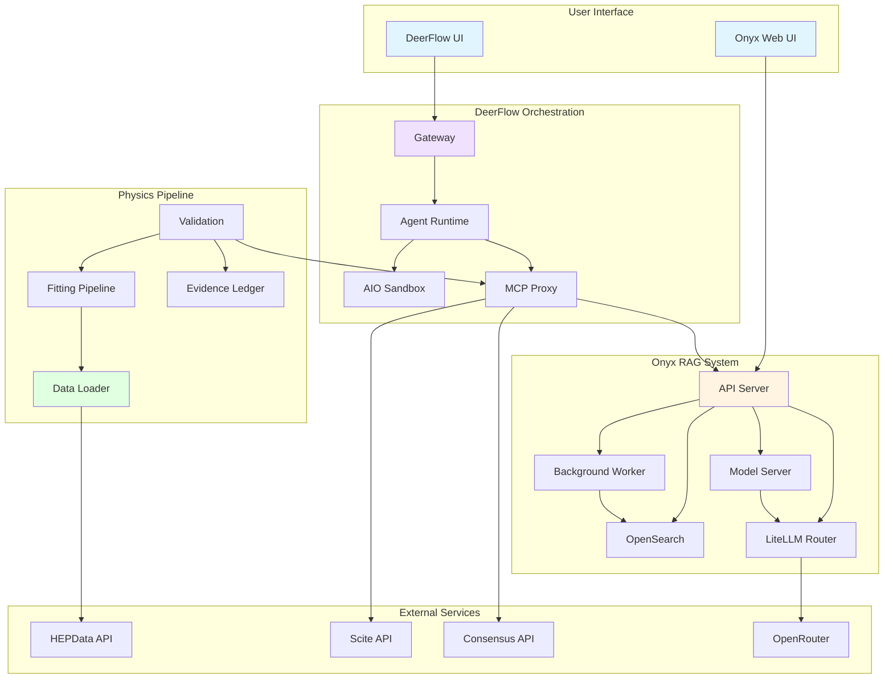

# AiSci Platform Workflows

**Purpose:** Comprehensive documentation of all platform workflows with Mermaid diagrams for understanding, testing, and debugging.

---

## Overview

The AiSci platform consists of three major components working together:

1. **Onyx** - RAG system for document indexing, search, and retrieval
2. **DeerFlow** - Agent orchestration for multi-step workflows
3. **Physics Pipeline** - Scientific data analysis and model fitting

This directory contains detailed workflow diagrams and feature matrices for each component.

---

## Quick Links

- [Onyx RAG Workflow](./onyx-rag-workflow.md) - Document ingestion, embedding, indexing, search
- [DeerFlow Agent Workflow](./deerflow-agent-workflow.md) - Agent execution, MCP integration, sandbox
- [Physics Pipeline Workflow](./physics-pipeline-workflow.md) - Data loading, fitting, validation
- [Integration Workflows](./integration-workflows.md) - Cross-component interactions
- [Feature Matrix](./feature-matrix.md) - All features with testability status

---

## Component Summary

### Onyx (RAG System)

**Purpose:** Index documents and provide semantic search for RAG queries

**Key Features:**
- Document connectors (File, GitHub, Web, API)
- Chunking and embedding generation
- OpenSearch indexing with hybrid search
- Persona-based filtering
- Tool integration (Scite, Consensus, HEP APIs)

**Status:** ✅ Operational (18/18 services running)

**Diagram:** [Onyx RAG Workflow](./onyx-rag-workflow.md)

---

### DeerFlow (Agent Orchestration)

**Purpose:** Orchestrate multi-agent workflows with tool execution

**Key Features:**
- LangGraph-based agent execution
- MCP tool integration (Onyx, GitHub, arXiv, etc.)
- AIO sandbox for code execution
- Multi-agent orchestration
- State persistence and recovery

**Status:** ✅ Running (3/3 services up)

**Diagram:** [DeerFlow Agent Workflow](./deerflow-agent-workflow.md)

---

### Physics Pipeline

**Purpose:** Analyze HEP particle spectra with curve fitting

**Key Features:**
- HEPData API integration
- 4 physics models (Jüttner, Bose-Einstein, Tsallis, Blast-Wave)
- iminuit/scipy optimization
- Model comparison (AIC, BIC, chi²/ndf)
- Evidence tracking and validation

**Status:** ✅ Operational (blocked on data availability)

**Diagram:** [Physics Pipeline Workflow](./physics-pipeline-workflow.md)

---

## Integration Points

### DeerFlow → Onyx (MCP Search)
- DeerFlow agents query Onyx via MCP proxy
- Search results formatted for agent consumption
- Authentication via bearer token

### Physics → Onyx (Literature Queries)
- Physics validation queries literature via Onyx
- Scite/Consensus tools for citation verification
- Results inform evidence ledger

### Full Research Workflow
- Upload document to Onyx
- DeerFlow agent analyzes and extracts claims
- Physics pipeline validates claims
- Results stored in evidence ledger

**Diagram:** [Integration Workflows](./integration-workflows.md)

---

## Testing Strategy

Each workflow has associated tests:

- **Unit Tests:** Individual functions and components
- **Integration Tests:** Component interactions
- **End-to-End Tests:** Full workflows
- **Smoke Tests:** Basic health checks

**See:** [Feature Matrix](./feature-matrix.md) for testability status

---

## Monitoring & Debugging

### Health Checks
```bash
# Check all services
docker ps | grep -E "(onyx|deer-flow)"

# Check Onyx health
curl http://localhost:3000/health

# Check DeerFlow health
curl http://localhost:2026/health

# Run smoke tests
pytest physics/tests/test_smoke.py
```

### Common Issues

**Onyx:**
- Embedding errors → Check model-server logs
- Search failures → Check OpenSearch status
- Connector errors → Check background worker logs

**DeerFlow:**
- Agent failures → Check gateway logs
- MCP errors → Check mcp-proxy logs
- Sandbox errors → Check file permissions

**Physics:**
- Data loading errors → Check HEPData API
- Fitting failures → Check input data format
- Validation errors → Check evidence ledger

---

## Architecture Diagram



---

## Data Flow

### Document Ingestion (Onyx)
```
Upload → Connector → Chunking → Embedding → OpenSearch → Indexed
```

### RAG Query (Onyx)
```
Query → Embedding → Search → Ranking → Context → LLM → Response
```

### Agent Execution (DeerFlow)
```
Task → Agent → Tool Call → MCP → External Service → Result → Agent → Response
```

### Physics Analysis
```
HEPData → Data Loader → Validation → Fitting → Model Comparison → Evidence Ledger
```

---

## Performance Metrics

### Onyx
- Embedding: 0.2s per query (warm)
- Search: 1-2s per query
- Indexing: ~100 docs/min

### DeerFlow
- Agent spawn: 1-2s
- Tool call: 2-5s (depends on tool)
- Sandbox execution: 1-10s (depends on command)

### Physics
- Data loading: 5-10s per dataset
- Fitting: 10-60s per model/bin
- Full pipeline: 5-15 min for all models

---

## Next Steps

1. Review workflow diagrams for accuracy
2. Identify missing workflows or edge cases
3. Add tests for critical paths
4. Monitor and update as platform evolves

---

**Last Updated:** 2026-05-31  
**Maintainer:** Platform Operations
