# DeerFlow Agent Workflow

**Purpose:** Document the DeerFlow agent orchestration workflow from task creation to execution and result collection.

---

## Overview

DeerFlow is an agent orchestration system built on LangGraph that executes multi-step workflows with tool integration. It provides:

1. **Agent Runtime** - LangGraph-based agent execution
2. **MCP Integration** - Model Context Protocol for tool access
3. **Sandbox Execution** - Isolated code execution environment
4. **State Management** - Persistent workflow state

---

## Architecture

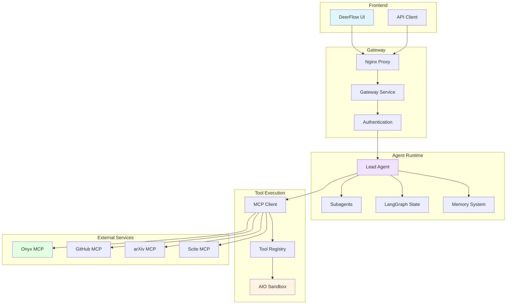

---

## Agent Execution Workflow

### Step 1: Task Creation

**Trigger:** User submits task via UI or API

**Input:**
```json
{
  "prompt": "Analyze the manuscript and extract physics claims",
  "agent_config": {
    "model": "gemini-2.5-flash",
    "temperature": 0.7,
    "max_turns": 50
  },
  "context": {
    "files": ["manuscript.pdf"],
    "workspace": "/mnt/host/aisci"
  }
}
```

**Process:**
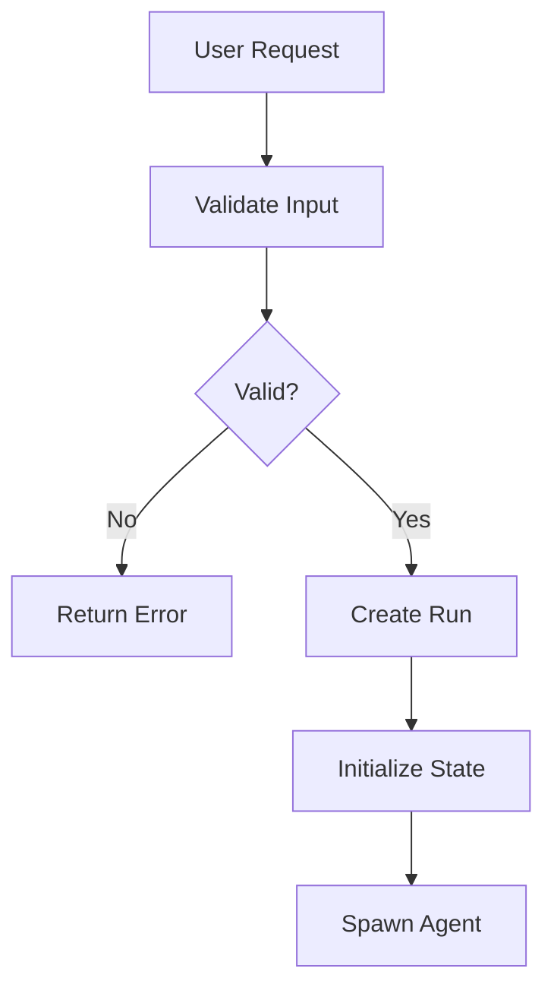

**Output:** Run ID and initial state

---

### Step 2: Agent Initialization

**Service:** `deer-flow-gateway`

**Process:**
1. Load agent configuration
2. Initialize LangGraph state
3. Set up tool access
4. Configure memory system

**Code:** `deployment/deer-flow/backend/app/gateway/agent_runtime.py`

**State Structure:**
```python
{
    "run_id": "run_abc123",
    "agent_id": "agent_xyz",
    "messages": [],
    "tool_calls": [],
    "memory": {},
    "status": "running",
    "turn": 0,
    "max_turns": 50
}
```

---

### Step 3: Task Execution Loop

**Framework:** LangGraph

**Loop:**
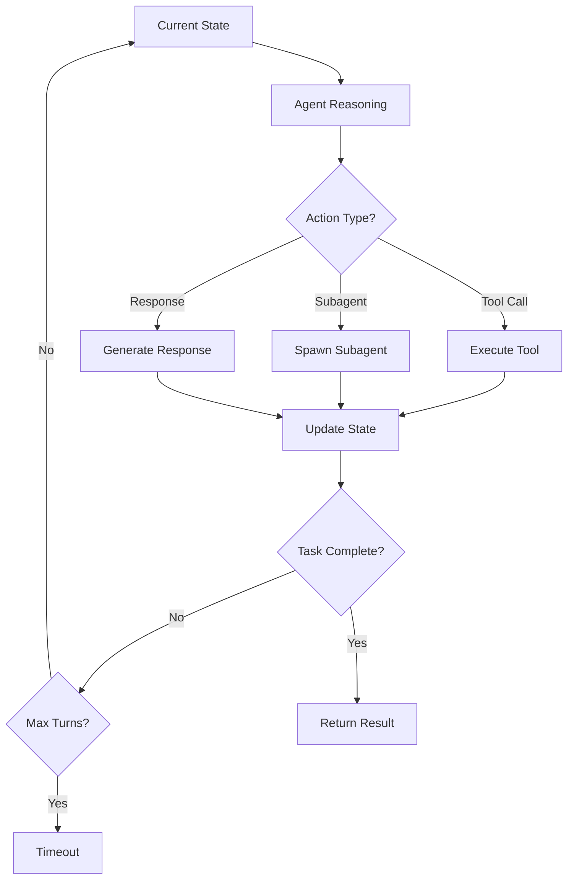

**Code:** `deployment/deer-flow/backend/app/gateway/graph.py`

---

### Step 4: Tool Execution

**MCP Integration:**

**Available Tools:**
- `onyx_search` - Search Onyx documents
- `github_*` - GitHub operations
- `arxiv_search` - arXiv paper search
- `scite_search` - Citation search
- `consensus_search` - Research consensus
- `bash` - Execute shell commands
- `read_file` - Read files
- `write_file` - Write files

**Process:**
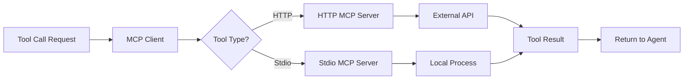

**Example:**
```python
# Agent decides to search Onyx
tool_call = {
    "tool": "onyx_search",
    "arguments": {
        "query": "Blast-Wave parameters",
        "persona_id": 2
    }
}

# MCP client executes
result = mcp_client.call_tool(
    server="onyx",
    tool="search_onyx",
    arguments=tool_call["arguments"]
)

# Result returned to agent
{
    "documents": [...],
    "citations": [...]
}
```

---

### Step 5: Sandbox Execution

**Purpose:** Isolated code execution for bash/python commands

**Provider:** AIO Sandbox

**Features:**
- Persistent workspace mount
- File system isolation
- Network access control
- Resource limits

**Process:**
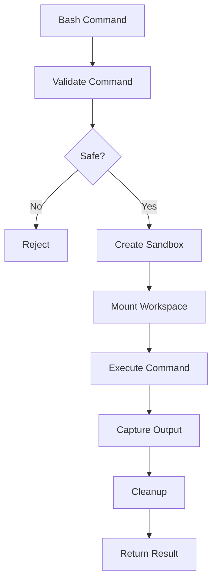

**Configuration:**
```yaml
sandbox:
  provider: aio
  workspace_mount: /mnt/host/aisci
  read_only: false
  timeout: 300
  memory_limit: 2GB
```

**Code:** `deployment/deer-flow/backend/app/gateway/sandbox/aio_provider.py`

---

### Step 6: Subagent Orchestration

**Purpose:** Delegate subtasks to specialized agents

**Types:**
- `general-purpose` - Generic tasks
- `bash` - Shell command execution
- `code-reviewer` - Code review
- `planner` - Task planning

**Process:**
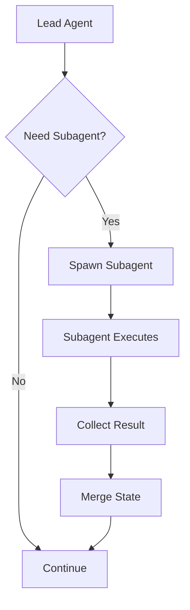

**Example:**
```python
# Lead agent spawns subagent
subagent_result = spawn_subagent(
    type="bash",
    prompt="Run the physics fitting pipeline",
    context={"workspace": "/mnt/host/aisci"}
)

# Subagent executes independently
# Result merged back to lead agent state
```

**Concurrency:**
- Max concurrent subagents: 6 (configurable)
- Hard cap: 8
- Scheduler workers: 8

---

### Step 7: Memory Management

**Purpose:** Extract and inject relevant context

**Components:**
1. **Memory Extraction** - Extract facts from conversation
2. **Memory Storage** - Store in vector database
3. **Memory Retrieval** - Retrieve relevant facts
4. **Memory Injection** - Inject into agent context

**Process:**
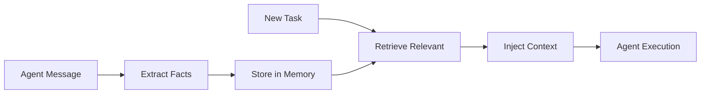

**Code:** `deployment/deer-flow/backend/app/gateway/memory/`

---

### Step 8: State Persistence

**Purpose:** Save workflow state for recovery

**Backend:** Database (SQLite/PostgreSQL)

**Schema:**
```sql
CREATE TABLE runs (
    id TEXT PRIMARY KEY,
    agent_id TEXT,
    status TEXT,
    state JSONB,
    created_at TIMESTAMP,
    updated_at TIMESTAMP
);
```

**Process:**
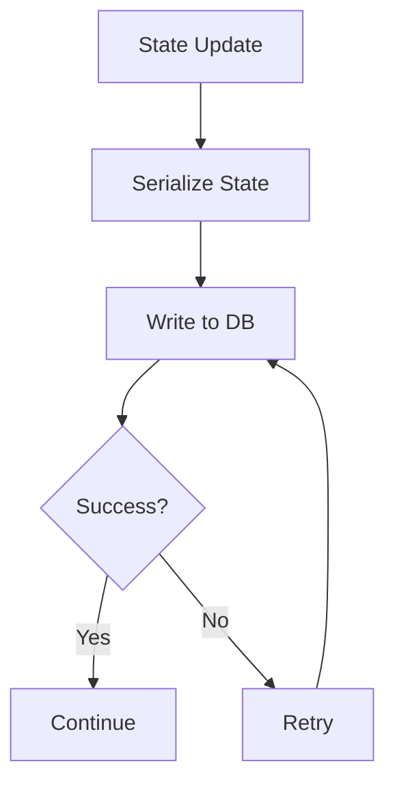

**Recovery:**
```python
# Resume from checkpoint
run = load_run(run_id)
state = deserialize_state(run.state)
agent = resume_agent(state)
```

---

## MCP Integration Details

### HTTP MCP Servers

**Onyx MCP:**
- Endpoint: `http://onyx-mcp-proxy:80/onyx/`
- Tools: `search_onyx`, `chat_with_onyx`
- Auth: Bearer token

**Scite MCP:**
- Endpoint: `http://onyx-mcp-proxy:80/scite/`
- Tools: `search_citations`
- Auth: OAuth bearer token

**Consensus MCP:**
- Endpoint: `http://onyx-mcp-proxy:80/consensus/`
- Tools: `search_papers`
- Auth: OAuth bearer token

### Stdio MCP Servers

**GitHub MCP:**
- Command: `npx -y @modelcontextprotocol/server-github`
- Tools: `create_issue`, `create_pr`, `search_repos`
- Auth: GitHub token

**arXiv MCP:**
- Command: `npx -y @fre4x/arxiv`
- Tools: `search_arxiv`
- Auth: None

**SQLite MCP:**
- Command: `uv tool run mcp-server-sqlite`
- Tools: `query`, `execute`
- Auth: None

---

## Workflow Examples

### Example 1: Literature Search

**Task:** "Find papers about Blast-Wave fits"

**Execution:**
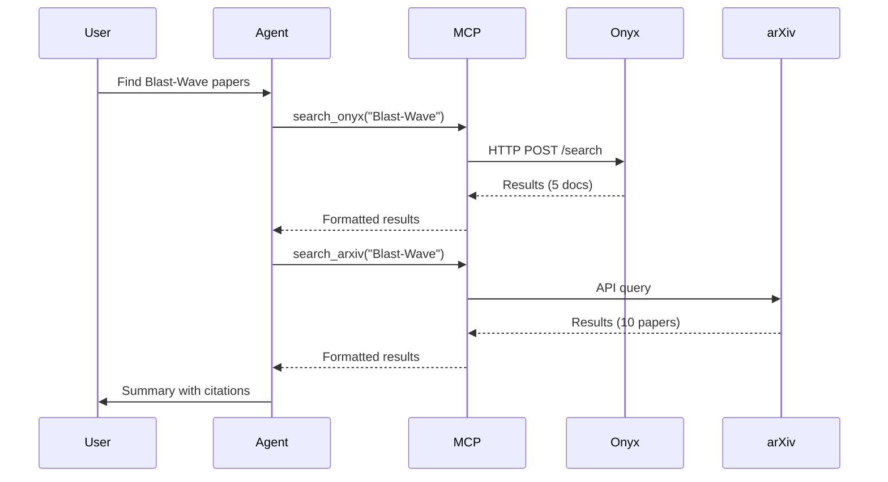

---

### Example 2: Code Execution

**Task:** "Run the physics fitting pipeline"

**Execution:**
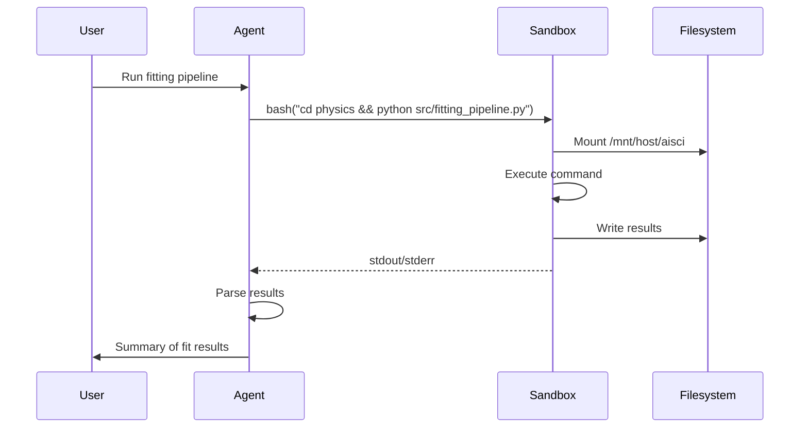

---

### Example 3: Multi-Agent Workflow

**Task:** "Analyze manuscript and validate claims"

**Execution:**
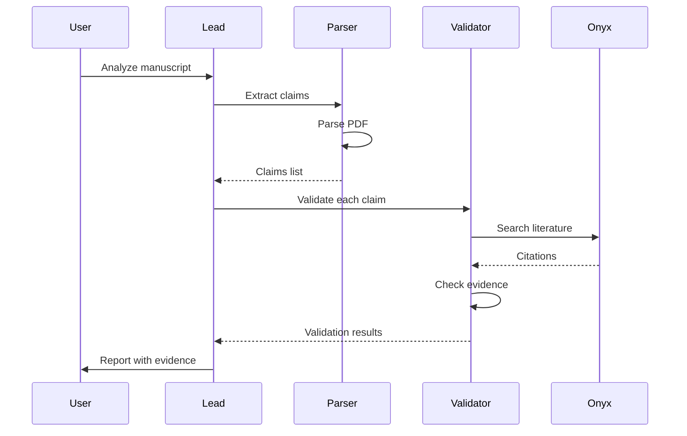

---

## Performance Metrics

### Agent Execution
- **Spawn time**: 1-2s
- **Turn latency**: 2-5s (depends on tool)
- **Max turns**: 50 (configurable)
- **Timeout**: 30 min (configurable)

### Tool Execution
- **MCP call**: 2-5s (depends on tool)
- **Sandbox exec**: 1-10s (depends on command)
- **Memory retrieval**: 0.5-1s

### Subagents
- **Spawn time**: 1-2s
- **Max concurrent**: 6
- **Queue depth**: Unlimited

---

## Error Handling

### Agent Errors

**Tool Call Failure:**
```python
try:
    result = mcp_client.call_tool(tool, args)
except ToolError as e:
    agent.handle_error(f"Tool {tool} failed: {e}")
    # Agent can retry or use alternative tool
```

**Sandbox Timeout:**
```python
try:
    result = sandbox.execute(command, timeout=300)
except TimeoutError:
    agent.handle_error("Command timed out")
    # Agent can retry with shorter command
```

**State Persistence Failure:**
```python
try:
    save_state(run_id, state)
except DatabaseError as e:
    log_error(f"Failed to save state: {e}")
    # Continue execution, retry on next update
```

---

## Monitoring

### Key Metrics

**Agent Runtime:**
- Active runs
- Average turn latency
- Tool call success rate
- Subagent spawn rate

**MCP Integration:**
- Tool call latency
- Tool call errors
- OAuth token expiry
- Proxy errors

**Sandbox:**
- Active sandboxes
- Command execution time
- File system usage
- Resource limits hit

### Health Checks

```bash
# Check gateway
curl http://localhost:2026/health

# Check active runs
curl http://localhost:2026/api/runs

# Check MCP servers
python3 deployment/helper/check_mcp_liveness.py

# Check sandbox
docker ps | grep deer-flow
```

---

## Testing

### Unit Tests
- Agent state management
- Tool call formatting
- Memory extraction
- Sandbox isolation

### Integration Tests
- Full agent execution
- MCP tool integration
- Subagent orchestration
- State persistence

### End-to-End Tests
- Multi-step workflows
- Error recovery
- Timeout handling
- Concurrent execution

**See:** `deployment/deer-flow/backend/tests/`

---

## Troubleshooting

### Issue: Agent Stuck

**Symptoms:** Agent not progressing, same turn repeated

**Diagnosis:**
```bash
# Check agent logs
docker logs deer-flow-gateway --tail 100

# Check run status
curl http://localhost:2026/api/runs/{run_id}
```

**Solutions:**
- Check for infinite loop in agent logic
- Verify tool calls are completing
- Check max_turns not reached

---

### Issue: MCP Tool Failures

**Symptoms:** Tool calls returning errors

**Diagnosis:**
```bash
# Check MCP liveness
python3 deployment/helper/check_mcp_liveness.py

# Check proxy logs
docker logs onyx-mcp-proxy --tail 100
```

**Solutions:**
- Verify OAuth tokens valid
- Check proxy routing
- Restart MCP servers

---

### Issue: Sandbox Permission Errors

**Symptoms:** File operations failing in sandbox

**Diagnosis:**
```bash
# Check file permissions
ls -la /home/ubuntu/aisci

# Check sandbox mounts
docker inspect deer-flow-gateway | grep Mounts
```

**Solutions:**
- Fix file permissions: `chmod 777 /home/ubuntu/aisci`
- Verify mount configuration
- Check sandbox user permissions

---

## References

- [LangGraph Documentation](https://langchain-ai.github.io/langgraph/)
- [Model Context Protocol](https://modelcontextprotocol.io/)
- [AIO Sandbox](https://github.com/aio-libs/aiohttp)
- [DeerFlow Configuration](../../deployment/deer-flow/config.yaml)

---

**Last Updated:** 2026-05-31  
**Maintainer:** Platform Operations
