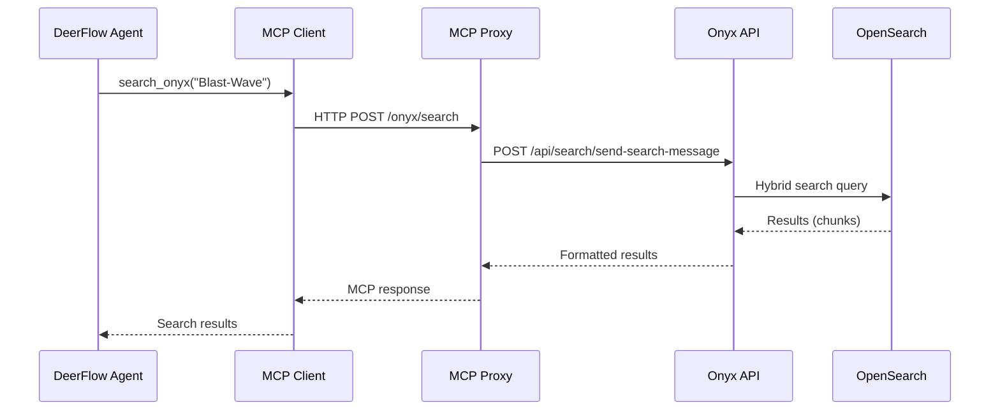
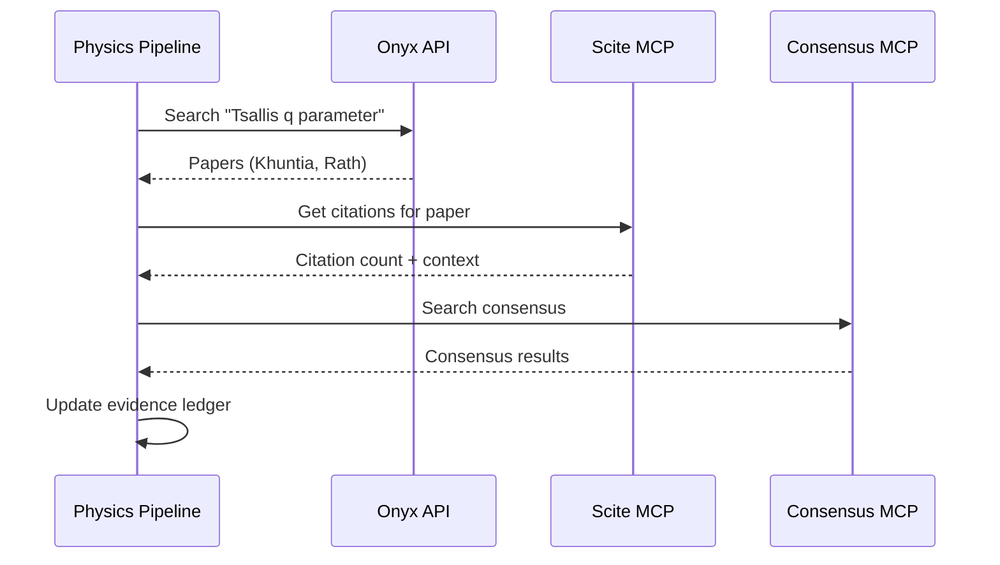
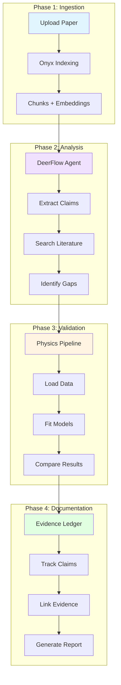

# Integration Workflows

**Purpose:** Document cross-component interactions and full platform workflows.

---

## Overview

The AiSci platform components integrate at multiple levels:

1. **DeerFlow → Onyx** - Agent searches via MCP
2. **Physics → Onyx** - Literature validation
3. **Full Research Workflow** - End-to-end analysis

---

## Integration 1: DeerFlow → Onyx (MCP Search)

### Purpose

DeerFlow agents query Onyx documents to ground responses in curated literature.

### Architecture



### Configuration

**MCP Proxy:** `onyx-mcp-proxy` (port 8095)

**Route:**
```nginx
location /onyx/ {
    proxy_pass http://api_server:8080/;
    proxy_set_header Authorization $http_authorization;
}
```

**DeerFlow Config:**
```json
{
  "name": "onyx",
  "type": "http",
  "url": "http://onyx-mcp-proxy:80/onyx/",
  "headers": {
    "Authorization": "Bearer ${ONYX_MCP_TOKEN}"
  }
}
```

### Example Workflow

**Task:** "Find papers about Tsallis distribution"

**Execution:**
```python
# Agent decides to search
tool_call = {
    "tool": "search_onyx",
    "arguments": {
        "query": "Tsallis distribution heavy ion collisions",
        "persona_id": 2,  # Physics Validator
        "limit": 5
    }
}

# MCP executes
results = mcp_client.call_tool("onyx", "search_onyx", tool_call["arguments"])

# Results returned
{
    "documents": [
        {
            "title": "Khuntia 2019 - Tsallis fits",
            "content": "The Tsallis distribution with q=1.15...",
            "source": "literature/Khuntia_2019_1808.02383.pdf",
            "page": 3
        },
        ...
    ],
    "citations": [1, 2, 3, 4, 5]
}
```

### Testing

**Unit Test:**
```python
def test_onyx_mcp_search():
    """Test MCP search returns results."""
    result = mcp_client.call_tool(
        "onyx",
        "search_onyx",
        {"query": "test", "persona_id": 2}
    )
    assert "documents" in result
    assert len(result["documents"]) > 0
```

**Integration Test:**
```python
def test_deerflow_agent_searches_onyx():
    """Test DeerFlow agent can search Onyx."""
    agent = create_agent("Find Tsallis papers")
    result = agent.execute()
    assert "Tsallis" in result.response
    assert len(result.tool_calls) > 0
```

---

## Integration 2: Physics → Onyx (Literature Validation)

### Purpose

Physics pipeline queries literature to validate claims against published results.

### Architecture



### Workflow

**Step 1: Extract Claim**
```python
# From fit results
claim = {
    "parameter": "q",
    "value": 1.15,
    "error": 0.03,
    "model": "Tsallis"
}
```

**Step 2: Query Literature**
```python
# Search Onyx
results = onyx_search(
    query=f"Tsallis q parameter {claim['value']}",
    persona_id=2
)

# Extract baseline values
baseline = extract_parameter_from_papers(results, "q")
```

**Step 3: Compare**
```python
# Check if within range
if abs(claim["value"] - baseline["value"]) < 2 * baseline["error"]:
    status = "CONSISTENT"
else:
    status = "INCONSISTENT"
```

**Step 4: Update Ledger**
```markdown
## Claim: Tsallis q = 1.15 ± 0.03

**Status:** ✅ CONSISTENT

**Literature:**
- Khuntia 2019: q = 1.14 ± 0.02
- Rath 2020: q = 1.16 ± 0.04

**Comparison:** Within 1σ of both baselines
```

### Testing

**Integration Test:**
```python
def test_physics_queries_literature():
    """Test physics pipeline can query Onyx."""
    # Run fitting pipeline
    results = run_fitting_pipeline("test_data.csv")
    
    # Query literature
    lit_results = query_literature(results["parameters"])
    
    # Verify results
    assert len(lit_results) > 0
    assert "Khuntia" in str(lit_results)
```

---

## Integration 3: Full Research Workflow

### Purpose

Complete end-to-end workflow from document upload to validated claims.

### Architecture



### Workflow Steps

#### Phase 1: Document Ingestion

**Input:** New manuscript PDF

**Process:**
1. Upload to Onyx
2. Parse and chunk
3. Generate embeddings
4. Index in OpenSearch

**Output:** Searchable document

**Time:** 5-10 minutes

---

#### Phase 2: Claim Extraction

**Input:** Indexed manuscript

**Process:**
1. DeerFlow agent reads manuscript
2. Extracts physics claims
3. Searches literature for each claim
4. Identifies novel claims

**Output:** List of claims with literature context

**Time:** 10-20 minutes

**Example:**
```json
{
    "claims": [
        {
            "text": "Jüttner distribution fits pp collisions",
            "type": "model_application",
            "literature": ["Khuntia 2019", "Rath 2020"],
            "novelty": "low"
        },
        {
            "text": "U₂ parameter shows instability at high multiplicity",
            "type": "observation",
            "literature": [],
            "novelty": "high"
        }
    ]
}
```

---

#### Phase 3: Numerical Validation

**Input:** Claims requiring numerical validation

**Process:**
1. Load HEPData
2. Run fitting pipeline
3. Compare parameters
4. Assess quality

**Output:** Fit results with quality metrics

**Time:** 15-30 minutes

**Example:**
```json
{
    "model": "Tsallis",
    "parameters": {
        "T": {"value": 0.145, "error": 0.003},
        "q": {"value": 1.15, "error": 0.03}
    },
    "quality": {
        "chi2_ndf": 2.51,
        "aic": 123.4,
        "status": "OK"
    },
    "comparison": {
        "Khuntia_2019": "CONSISTENT",
        "Rath_2020": "CONSISTENT"
    }
}
```

---

#### Phase 4: Evidence Documentation

**Input:** Validated claims

**Process:**
1. Update evidence ledger
2. Link to run artifacts
3. Add citations
4. Generate summary

**Output:** Updated evidence ledger

**Time:** 5 minutes

**Example Entry:**
```markdown
## Claim: Tsallis Distribution Fits pp Collisions

**Status:** ✅ VERIFIED

**Evidence:**
- Numerical fit: chi²/ndf = 2.51 (OK)
- Literature: Consistent with Khuntia 2019, Rath 2020
- Parameters: T = 0.145 ± 0.003 GeV, q = 1.15 ± 0.03

**Artifacts:**
- Run: 2026-05-31-o03-tsallis-bgbw-fit
- Fit quality: fit_quality.csv
- Diagnostics: diagnostics/21-30__tsallis__1c.png

**Citations:**
- [Khuntia 2019](https://arxiv.org/abs/1808.02383)
- [Rath 2020](https://arxiv.org/abs/1908.04208)
```

---

### End-to-End Test

**Test Scenario:** Validate new manuscript claim

```python
def test_full_research_workflow():
    """Test complete workflow from upload to validation."""
    
    # Phase 1: Upload document
    doc_id = upload_document("manuscript.pdf")
    wait_for_indexing(doc_id)
    
    # Phase 2: Extract claims
    agent = create_agent("Extract physics claims from manuscript")
    claims = agent.execute()
    assert len(claims) > 0
    
    # Phase 3: Validate numerically
    for claim in claims:
        if claim["requires_fitting"]:
            results = run_fitting_pipeline(claim["data"])
            assert results["quality"]["status"] == "OK"
    
    # Phase 4: Update ledger
    ledger = update_evidence_ledger(claims, results)
    assert ledger["updated"] == True
```

---

## Performance Metrics

### Integration Latencies

| Integration | Latency | Bottleneck |
|-------------|---------|------------|
| DeerFlow → Onyx | 2-5s | Search + ranking |
| Physics → Onyx | 5-10s | Multiple queries |
| Full Workflow | 30-60 min | Fitting pipeline |

### Throughput

| Workflow | Throughput | Parallelization |
|----------|-----------|-----------------|
| MCP Search | 10 queries/min | Yes (concurrent) |
| Literature Validation | 5 claims/min | Yes (batch) |
| Full Research | 1 paper/hour | Limited (sequential) |

---

## Error Handling

### MCP Connection Failures

**Symptom:** DeerFlow agent cannot reach Onyx

**Diagnosis:**
```bash
# Check MCP proxy
curl http://localhost:8095/onyx/health

# Check Onyx API
curl http://localhost:3000/health
```

**Recovery:**
```python
try:
    result = mcp_client.call_tool("onyx", "search", args)
except MCPError as e:
    log_error(f"MCP call failed: {e}")
    # Fallback to direct API
    result = onyx_api.search(args)
```

---

### Data Pipeline Failures

**Symptom:** Physics pipeline cannot load data

**Diagnosis:**
```bash
# Check HEPData
curl https://www.hepdata.net/record/ins1735345

# Check data loader
python3 physics/src/data_loader.py --record ins1735345
```

**Recovery:**
```python
try:
    data = load_hepdata(record_id)
except DataLoadError as e:
    log_error(f"Data load failed: {e}")
    # Use cached data
    data = load_cached_data(record_id)
```

---

## Monitoring

### Integration Health

```bash
# Check all integrations
python3 deployment/helper/check_integrations.sh

# Output:
# ✅ DeerFlow → Onyx: OK (2.3s latency)
# ✅ Physics → Onyx: OK (5.1s latency)
# ⚠️ Full Workflow: SLOW (45 min last run)
```

### Metrics Dashboard

**Key Metrics:**
- MCP call success rate
- Average search latency
- Fitting pipeline success rate
- Evidence ledger update frequency

---

## Best Practices

### 1. Use Persona Filtering

**Good:**
```python
# Restrict to relevant document sets
search_onyx(query="Tsallis", persona_id=2)
```

**Bad:**
```python
# Search all documents (slow, irrelevant results)
search_onyx(query="Tsallis")
```

---

### 2. Batch Literature Queries

**Good:**
```python
# Batch multiple claims
claims = ["claim1", "claim2", "claim3"]
results = batch_query_literature(claims)
```

**Bad:**
```python
# Query one at a time
for claim in claims:
    result = query_literature(claim)  # Slow
```

---

### 3. Cache Fit Results

**Good:**
```python
# Check cache first
cache_key = hash(data)
if cache_key in fit_cache:
    return fit_cache[cache_key]
else:
    result = run_fitting_pipeline(data)
    fit_cache[cache_key] = result
    return result
```

**Bad:**
```python
# Always recompute
result = run_fitting_pipeline(data)  # Slow
```

---

## References

- [Onyx RAG Workflow](./onyx-rag-workflow.md)
- [DeerFlow Agent Workflow](./deerflow-agent-workflow.md)
- [Physics Pipeline Workflow](./physics-pipeline-workflow.md)
- [MCP Proxy Configuration](../../deployment/onyx/nginx_configs/mcp_proxy.conf.template)

---

**Last Updated:** 2026-05-31  
**Maintainer:** Platform Operations
