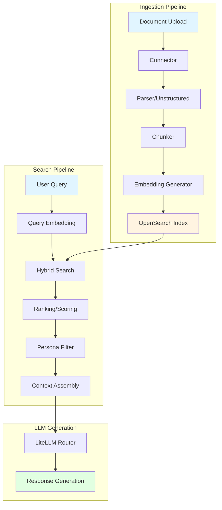
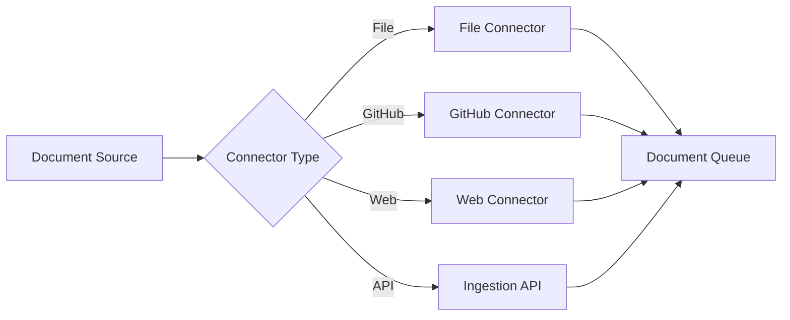
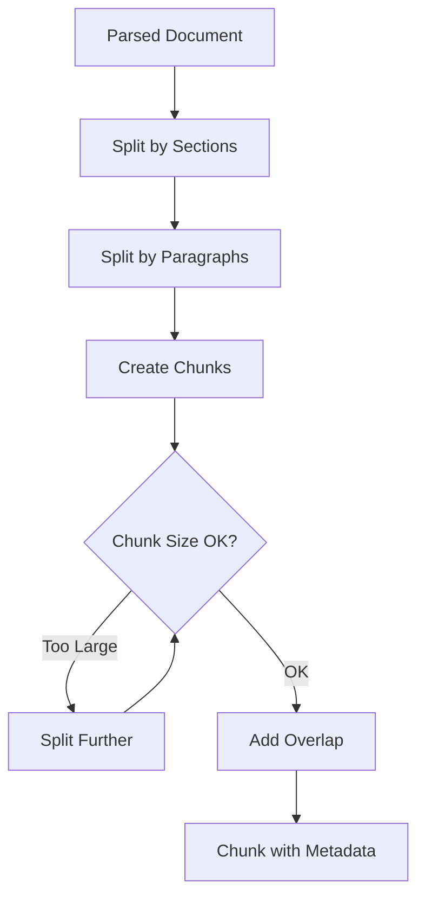
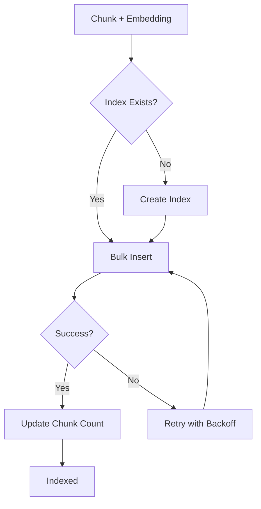
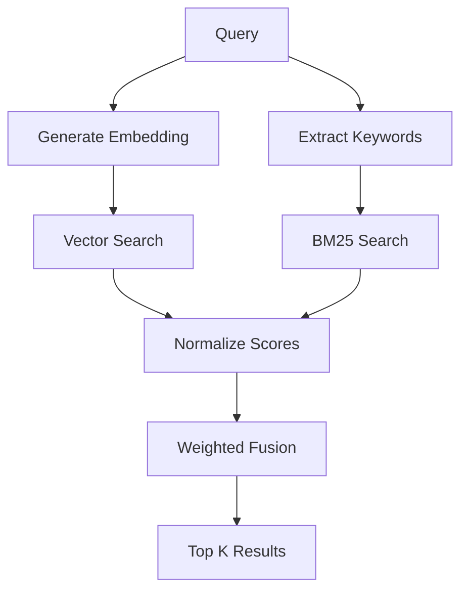
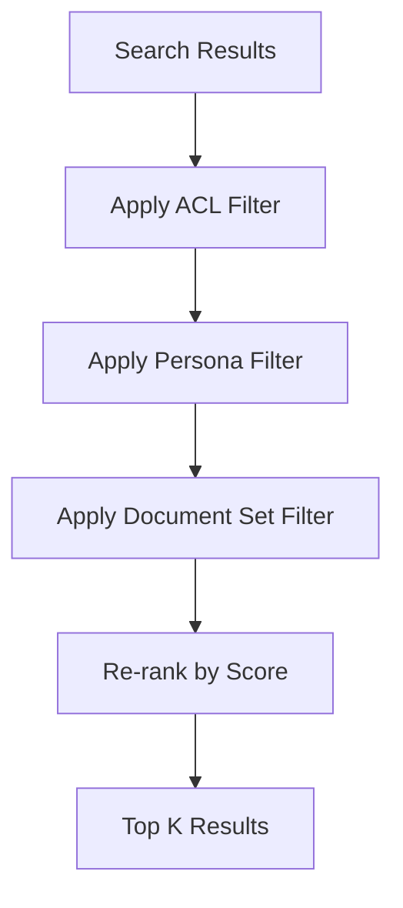
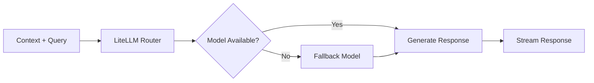

# Onyx RAG Workflow

**Purpose:** Document the complete Onyx RAG workflow from document ingestion to search and retrieval.

---

## Overview

Onyx is a Retrieval-Augmented Generation (RAG) system that indexes documents and provides semantic search capabilities. It consists of two main workflows:

1. **Ingestion Workflow** - Document → Chunks → Embeddings → Index
2. **Search Workflow** - Query → Embedding → Search → Ranking → Context

---

## Architecture



---

## Ingestion Workflow

### Step 1: Document Upload

**Trigger:** User uploads document or connector runs

**Input:**
- PDF, DOCX, TXT, HTML, Markdown files
- GitHub repositories
- Web pages
- API responses

**Process:**


**Output:** Document in processing queue

---

### Step 2: Parsing

**Service:** `onyx-unstructured` (port 8000)

**Process:**
1. Extract text from document
2. Preserve structure (headings, lists, tables)
3. Extract metadata (title, author, date)
4. Handle images (OCR if needed)

**Code:** `deployment/onyx/document_processing.py`

**Example:**
```python
# Parse PDF document
parsed = parse_document(
    file_path="paper.pdf",
    extract_images=True,
    ocr_enabled=True
)
# Returns: {text, metadata, images}
```

---

### Step 3: Chunking

**Service:** `onyx-background` worker

**Strategy:** Semantic chunking with overlap

**Parameters:**
- Chunk size: 512 tokens (default)
- Overlap: 50 tokens
- Preserve sentence boundaries

**Process:**


**Code:** `deployment/onyx/chunking.py`

**Output:**
```json
{
  "chunk_id": "doc123_chunk001",
  "content": "The Jüttner distribution describes...",
  "metadata": {
    "document_id": "doc123",
    "section": "Introduction",
    "page": 1,
    "chunk_index": 0
  }
}
```

---

### Step 4: Embedding Generation

**Service:** `onyx-inference-model-server`

**Model:** `Alibaba-NLP/gte-Qwen2-1.5B-instruct` (1536 dimensions)

**Performance:**
- Warm: 0.2s per embedding
- Cold: 27s first load
- Batch: 10 embeddings/s

**Process:**


**Code:** `deployment/onyx/embedding_generation.py`

**Example:**
```python
# Generate embedding
embedding = generate_embedding(
    text="The Jüttner distribution describes...",
    model="Alibaba-NLP/gte-Qwen2-1.5B-instruct"
)
# Returns: [0.123, -0.456, ..., 0.789] (1536 dims)
```

---

### Step 5: Indexing

**Service:** `onyx-opensearch`

**Index:** `danswer_chunk_alibaba_nlp_gte_qwen2_1_5b_instruct`

**Schema:**
```json
{
  "chunk_id": "string",
  "content": "text",
  "title_embedding": "dense_vector[1536]",
  "content_embedding": "dense_vector[1536]",
  "metadata": {
    "document_id": "string",
    "document_set_ids": ["string"],
    "access_control_list": ["string"],
    "persona_ids": ["integer"]
  }
}
```

**Process:**


**Code:** `deployment/onyx/opensearch_document_index.py`

---

## Search Workflow

### Step 1: Query Processing

**Input:** User query text

**Process:**
1. Parse query intent
2. Extract filters (date, author, document set)
3. Generate query embedding

**Example:**
```python
query = "What are typical Blast-Wave parameters?"
filters = {
    "document_set_ids": [2],  # Robert Corpus
    "persona_id": 2  # Physics Validator
}
```

---

### Step 2: Hybrid Search

**Strategy:** Semantic + Keyword with normalization

**Components:**
1. **Semantic Search** - Vector similarity (cosine)
2. **Keyword Search** - BM25 scoring
3. **Normalization** - Min-max scaling
4. **Fusion** - Weighted combination

**Process:**


**Weights:**
- Semantic: 0.7
- Keyword: 0.3

**Code:** `deployment/onyx/search.py`

---

### Step 3: Ranking & Filtering

**Ranking Factors:**
1. Relevance score (hybrid)
2. Recency (time decay)
3. Document quality (metadata)
4. User feedback (implicit)

**Filters:**
1. **Access Control** - User permissions
2. **Persona** - Persona-specific document sets
3. **Document Set** - Explicit filtering
4. **Date Range** - Time-based filtering

**Process:**


---

### Step 4: Context Assembly

**Purpose:** Prepare context for LLM generation

**Process:**
1. Extract top K chunks (default: 5)
2. Add metadata (source, page, section)
3. Format for LLM prompt
4. Add citations

**Template:**
```
Context from retrieved documents:

[1] Source: paper.pdf (page 3)
Content: The Jüttner distribution describes...

[2] Source: thesis.pdf (page 12)
Content: Blast-Wave fits typically use...

---

User Query: {query}

Based on the context above, provide an answer with citations.
```

**Code:** `deployment/onyx/context_assembly.py`

---

### Step 5: LLM Generation

**Service:** `onyx-litellm` (port 4001)

**Model:** `gemini-2.5-flash` (optimized config)

**Process:**


**Features:**
- Streaming responses
- Citation tracking
- Error handling
- Fallback routing

---

## Persona-Based Filtering

**Purpose:** Restrict search to persona-specific document sets

**Example:**

**Physics Validator Persona (id=2):**
- Document Sets: Robert Corpus (id=2), HEP Phenomenology (id=6)
- Tools: Scite, Consensus, arXiv, INSPIRE-HEP
- Prompt: Physics validation instructions

**Search Query:**
```python
search(
    query="Blast-Wave parameters",
    persona_id=2
)
# Only searches Robert Corpus + HEP Phenomenology
```

---

## Performance Metrics

### Ingestion
- **Parsing**: 1-5s per document
- **Chunking**: 0.1s per document
- **Embedding**: 0.2s per chunk (warm)
- **Indexing**: 0.1s per chunk
- **Total**: ~100 documents/min

### Search
- **Query embedding**: 0.2s
- **Hybrid search**: 0.5-1s
- **Ranking**: 0.1s
- **Context assembly**: 0.1s
- **LLM generation**: 2-5s
- **Total**: 3-7s per query

---

## Error Handling

### Ingestion Errors

**Parsing Failure:**
```python
try:
    parsed = parse_document(file_path)
except ParsingError as e:
    log_error(f"Failed to parse {file_path}: {e}")
    mark_document_failed(document_id)
```

**Embedding Failure:**
```python
try:
    embedding = generate_embedding(text)
except EmbeddingError as e:
    log_error(f"Failed to generate embedding: {e}")
    retry_with_backoff(generate_embedding, text)
```

**Indexing Failure:**
```python
try:
    index_chunk(chunk, embedding)
except IndexingError as e:
    log_error(f"Failed to index chunk: {e}")
    add_to_retry_queue(chunk)
```

### Search Errors

**Search Timeout:**
```python
try:
    results = search(query, timeout=30)
except TimeoutError:
    return fallback_results(query)
```

**LLM Quota Exhausted:**
```python
try:
    response = llm.generate(context)
except QuotaError:
    response = fallback_llm.generate(context)
```

---

## Monitoring

### Key Metrics

**Ingestion:**
- Documents processed/hour
- Chunks indexed/hour
- Embedding generation time
- Indexing errors/hour

**Search:**
- Queries/hour
- Average latency
- Search errors/hour
- LLM quota usage

### Health Checks

```bash
# Check OpenSearch
curl http://localhost:9200/_cluster/health

# Check embedding model
curl http://localhost:8080/health

# Check LiteLLM
curl http://localhost:4001/health

# Check indexing queue
python3 deployment/helper/check_indexing_status.sh
```

---

## Testing

### Unit Tests
- Chunking logic
- Embedding generation
- Search ranking
- Context assembly

### Integration Tests
- Full ingestion pipeline
- Full search pipeline
- Persona filtering
- Error recovery

### End-to-End Tests
- Upload → Index → Search → Retrieve
- Multi-document search
- Cross-connector search

**See:** `deployment/onyx/tests/` (to be created)

---

## Troubleshooting

### Issue: Slow Indexing

**Symptoms:** Documents taking >10 min to index

**Diagnosis:**
```bash
# Check background worker logs
docker logs onyx-background --tail 100

# Check embedding model performance
docker logs onyx-inference-model-server --tail 100
```

**Solutions:**
- Increase worker concurrency
- Batch embedding generation
- Check model server memory

---

### Issue: Poor Search Results

**Symptoms:** Irrelevant results returned

**Diagnosis:**
```bash
# Check search query
python3 deployment/helper/test_search.py --query "test query"

# Check index parity
python3 deployment/helper/onyx_opensearch_cutover.py --json
```

**Solutions:**
- Adjust hybrid search weights
- Improve chunking strategy
- Re-index with better embeddings

---

### Issue: LLM Quota Exhausted

**Symptoms:** 429 errors, failed generations

**Diagnosis:**
```bash
# Check quota status
python3 deployment/helper/monitor_model_quotas.py

# Check LiteLLM logs
docker logs onyx-litellm --tail 100 | grep "429\|quota"
```

**Solutions:**
- Switch to paid-tier models
- Use local fallback (gemma2:27b)
- Add cooldown period

---

## References

- [OpenSearch Documentation](https://opensearch.org/docs/)
- [LiteLLM Router](https://docs.litellm.ai/docs/routing)
- [Unstructured.io](https://unstructured.io/)
- [Model Optimization Report](../ops/model-optimization-report.md)

---

**Last Updated:** 2026-05-31  
**Maintainer:** Platform Operations
