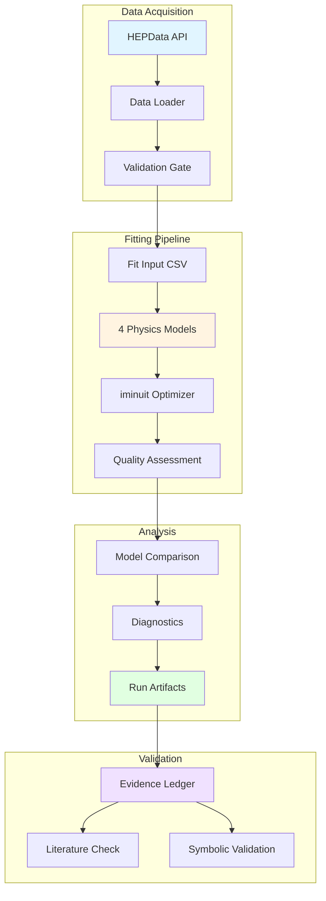
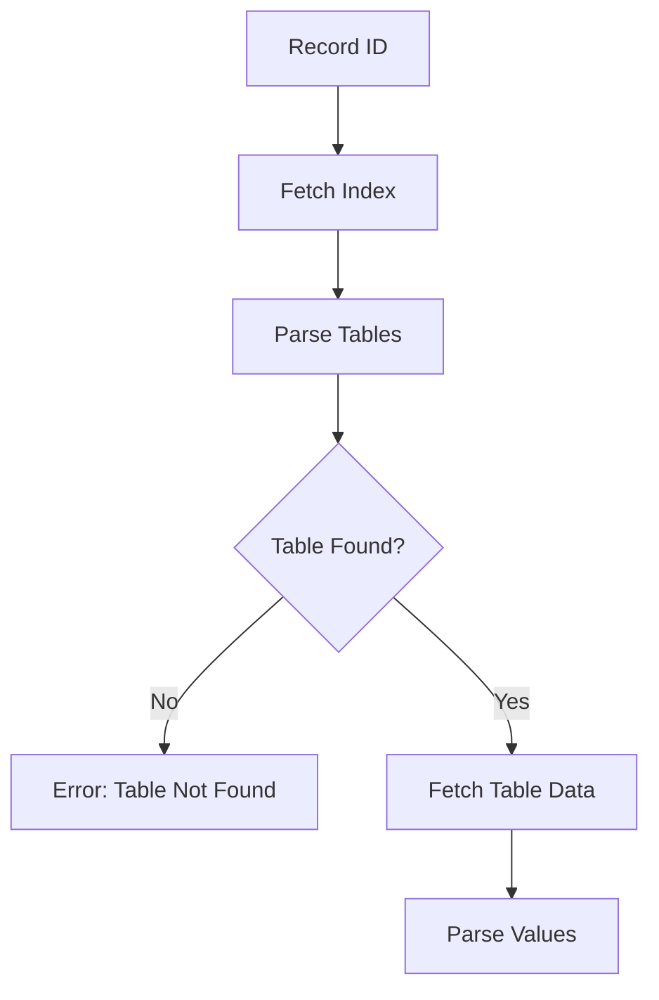
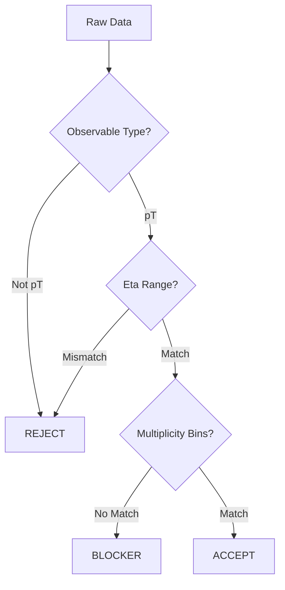
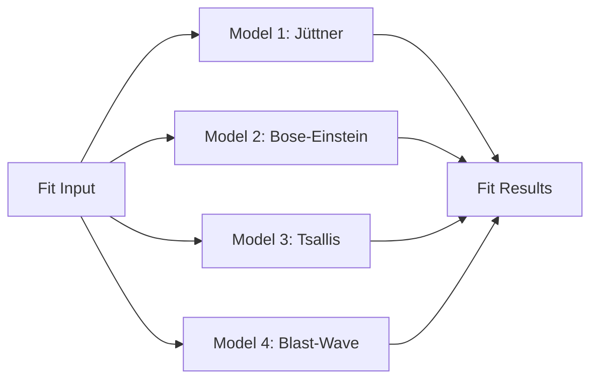
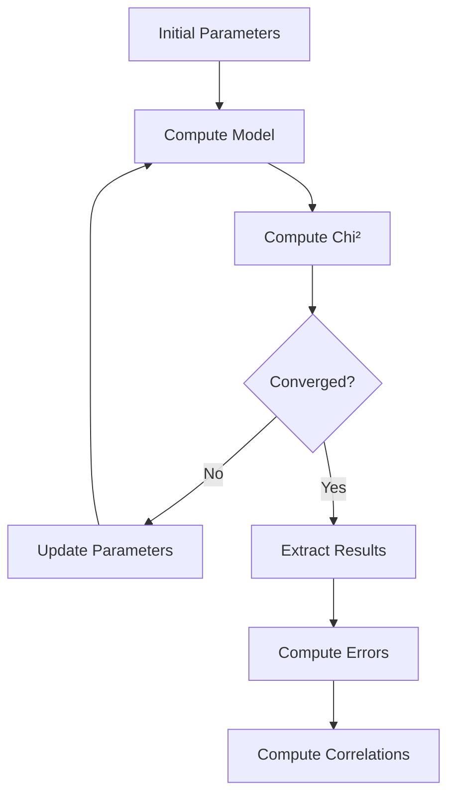
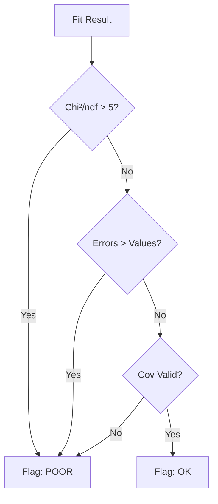
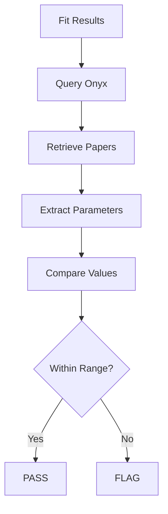

# Physics Pipeline Workflow

**Purpose:** Document the physics analysis pipeline for HEP particle spectra fitting and validation.

---

## Overview

The physics pipeline analyzes high-energy physics (HEP) particle spectra using curve fitting with multiple theoretical models. It consists of:

1. **Data Loading** - Fetch and validate HEPData records
2. **Model Fitting** - Fit 4 physics models to spectra
3. **Quality Assessment** - Evaluate fit quality and model comparison
4. **Validation** - Verify against literature and evidence ledger

---

## Architecture



---

## Data Loading Workflow

### Step 1: HEPData API Query

**Service:** HEPData REST API

**Input:**
- Record ID (e.g., `ins1735345`)
- Table index (e.g., `1`)

**Process:**


**Code:** `physics/src/data_loader.py`

**Example:**
```python
# Fetch ALICE pp 13 TeV data
data = fetch_hepdata(
    record_id="ins1735345",
    table_index=1
)
# Returns: {metadata, values, errors}
```

---

### Step 2: Data Validation

**Purpose:** Ensure data matches manuscript requirements

**Validation Gates:**
1. **Observable Type** - Must be pT spectrum
2. **Eta Range** - Must match manuscript bins
3. **Multiplicity Bins** - Must match manuscript bins (21-30, 31-40, etc.)
4. **Error Bars** - Must have statistical and systematic errors

**Process:**


**Blocker Example:**
```json
{
  "status": "BLOCKED",
  "reason": "No per-multiplicity-bin pT spectra found",
  "available": "Only inclusive (N≥1) spectrum",
  "required": "Per-bin spectra (21-30, 31-40, ...)"
}
```

**Code:** `physics/src/data_loader.py:validate_multiplicity_bins()`

---

### Step 3: Data Extraction

**Output:** `fit_input.csv`

**Format:**
```csv
multiplicity_bin,pT_GeV,dN_dpT,stat_error,sys_error,total_error
21-30,0.5,1234.5,12.3,45.6,47.2
21-30,0.6,1156.2,11.2,42.1,43.6
...
```

**Columns:**
- `multiplicity_bin` - Multiplicity range (e.g., "21-30")
- `pT_GeV` - Transverse momentum in GeV
- `dN_dpT` - Differential yield
- `stat_error` - Statistical error
- `sys_error` - Systematic error
- `total_error` - Combined error (quadrature)

---

## Fitting Pipeline Workflow

### Step 1: Model Selection

**Available Models:**

1. **Manuscript Jüttner** - Covariant Boltzmann
2. **Exact Bose-Einstein** - Quantum statistics
3. **Tsallis** - Non-extensive statistics
4. **Blast-Wave** - Radial flow

**Process:**


---

### Step 2: Model Fitting

**Optimizer:** iminuit (MINUIT2)

**Cost Function:** Least Squares (chi-squared)

**Process:**


**Example: Jüttner Model**

**Formula:**
```
dN/dpT = norm × ∫ exp(-β U·p) dη
```

**Parameters:**
- `norm` - Normalization
- `T` - Temperature (GeV)
- `U` - Flow velocity

**Fit:**
```python
# Define cost function
def chi_squared(norm, T, U):
    model = juttner_model(pT, norm, T, U)
    return np.sum(((data - model) / error) ** 2)

# Run minimization
m = Minuit(chi_squared, norm=1000, T=0.15, U=0.5)
m.migrad()

# Extract results
params = m.values
errors = m.errors
chi2 = m.fval
ndf = len(data) - len(params)
```

**Code:** `physics/src/fitting_pipeline.py`

---

### Step 3: Quality Assessment

**Metrics:**

1. **Chi²/ndf** - Goodness of fit
2. **AIC** - Akaike Information Criterion
3. **BIC** - Bayesian Information Criterion
4. **Parameter Errors** - Uncertainty quantification
5. **Correlations** - Parameter correlations

**Quality Flags:**

**POOR Fit:**
- Chi²/ndf > 5
- Parameter error/value > 1 (unconstrained)
- Covariance matrix not positive definite

**OK Fit:**
- Chi²/ndf ≤ 5
- All parameters constrained
- Covariance matrix valid

**Process:**


---

### Step 4: Model Comparison

**Criteria:**

1. **AIC** - Lower is better
2. **BIC** - Lower is better (penalizes complexity)
3. **Chi²/ndf** - Closer to 1 is better

**Ranking:**
```python
# Rank models by AIC
models_ranked = sorted(models, key=lambda m: m.aic)

# Best model
best_model = models_ranked[0]
```

**Output:** `model_comparison.csv`

```csv
model,components,chi2,ndf,chi2_ndf,aic,bic,rank
tsallis,1,45.2,18,2.51,123.4,128.9,1
juttner,1,48.7,18,2.71,126.1,131.6,2
blast_wave,1,52.3,18,2.91,129.8,135.3,3
bose,1,55.1,18,3.06,132.5,138.0,4
```

---

### Step 5: Diagnostics Generation

**Outputs:**

1. **Residuals** - (data - model) / error
2. **Pulls** - Normalized residuals
3. **Predictions** - Model curves
4. **Plots** - 4-panel diagnostic plots

**4-Panel Plot:**
```
┌─────────────────┬─────────────────┐
│ Data + Fit      │ Residuals vs pT │
├─────────────────┼─────────────────┤
│ Pulls vs pT     │ Pull Histogram  │
└─────────────────┴─────────────────┘
```

**Code:** `physics/src/fitting_pipeline.py:plot_diagnostics()`

---

## Run Artifacts

**Directory Structure:**
```
research/robert/runs/2026-05-31-o03-tsallis-bgbw-fit/
├── fit_input.csv                    # Input data
├── model_catalog.json               # Model definitions
├── fit_parameters.csv               # Fitted parameters
├── fit_quality.csv                  # Quality metrics
├── parameter_correlations.csv       # Correlation matrices
├── model_comparison.csv             # Model ranking
├── diagnostics/
│   ├── 21-30__tsallis__1c_residuals.csv
│   ├── 21-30__tsallis__1c.png
│   └── ...
└── covariance/
    ├── 21-30__tsallis__1c.csv
    └── ...
```

---

## Validation Workflow

### Step 1: Symbolic Validation

**Purpose:** Verify mathematical correctness

**Tools:** SymPy

**Checks:**
1. Lorentz covariance
2. Delta-function integration
3. Velocity parameterization
4. Dimensional analysis

**Code:** `physics/src/boson_paper_analysis.py`

**Example:**
```python
# Verify U·p identity
U_dot_p = E * sp.cosh(Y) - pz * sp.sinh(Y)
assert U_dot_p.simplify() == E_cosh_Y_minus_pz_sinh_Y
```

---

### Step 2: Literature Comparison

**Purpose:** Compare against published baselines

**Baselines:**
- Khuntia 2019 (arXiv:1808.02383) - Tsallis
- Rath 2020 (arXiv:1908.04208) - Blast-Wave

**Process:**


**Code:** `physics/src/tsallis_physics_validation.py`

---

### Step 3: Evidence Ledger Update

**Purpose:** Track validated claims

**Ledger:** `research/robert/evidence-ledger.md`

**Entry Format:**
```markdown
## Claim: Jüttner Distribution Form

**Status:** ✅ VERIFIED

**Evidence:**
- Symbolic validation: PASS
- Literature comparison: Khuntia 2019 matches
- Fit quality: chi²/ndf = 2.51 (OK)

**Source:** Run 2026-05-31-o03-tsallis-bgbw-fit

**Notes:** Temperature T = 0.145 ± 0.003 GeV consistent with literature
```

---

## Physics Models

### Model 1: Manuscript Jüttner

**Formula:**
```
dN/dpT = norm × ∫ exp(-β U·p) dη
```

**Parameters:**
- `norm` - Normalization
- `T` - Temperature (GeV)
- `U` - Flow velocity

**Physics:** Covariant Boltzmann distribution with flow

**Use Case:** Baseline from manuscript

---

### Model 2: Exact Bose-Einstein

**Formula:**
```
dN/dpT = norm × ∫ 1/(exp(β U·p) - 1) dη
```

**Parameters:**
- `norm` - Normalization
- `T` - Temperature (GeV)
- `U` - Flow velocity

**Physics:** Quantum statistics (bosons)

**Use Case:** Test if quantum effects matter

---

### Model 3: Tsallis

**Formula:**
```
dN/dpT = norm × [1 + (q-1)E/T]^(-q/(q-1))
```

**Parameters:**
- `norm` - Normalization
- `T` - Temperature (GeV)
- `q` - Non-extensivity parameter

**Physics:** Non-extensive statistics

**Use Case:** Literature baseline (Khuntia, Rath)

---

### Model 4: Blast-Wave

**Formula:**
```
dN/dpT = norm × ∫ r dr I₀(pT sinh ρ) K₁(mT cosh ρ)
```

**Parameters:**
- `norm` - Normalization
- `T` - Temperature (GeV)
- `β_s` - Surface velocity
- `n` - Flow profile exponent

**Physics:** Radial flow with Bessel functions

**Use Case:** ALICE/CMS standard

---

## Performance Metrics

### Data Loading
- **HEPData fetch**: 5-10s per dataset
- **Validation**: <1s
- **CSV write**: <1s

### Fitting
- **Single fit**: 10-60s per model/bin
- **All models**: 5-15 min (4 models × 10 bins)
- **Diagnostics**: 2-5 min (plotting)

### Validation
- **Symbolic**: 1-2s
- **Literature**: 5-10s (Onyx query)
- **Ledger update**: <1s

---

## Error Handling

### Data Loading Errors

**HEPData Unavailable:**
```python
try:
    data = fetch_hepdata(record_id)
except requests.Timeout:
    log_error("HEPData timeout")
    return None
```

**Validation Failure:**
```python
if not validate_multiplicity_bins(data):
    write_blocker_file({
        "status": "BLOCKED",
        "reason": "No per-bin spectra"
    })
    sys.exit(1)
```

---

### Fitting Errors

**Convergence Failure:**
```python
m.migrad()
if not m.valid:
    log_warning(f"Fit did not converge: {m.fmin}")
    flag_as_poor(fit_result)
```

**Parameter Bounds:**
```python
m.limits["T"] = (0.05, 0.5)  # Physical bounds
m.limits["U"] = (0.0, 1.0)   # Subluminal
```

---

## Monitoring

### Key Metrics

**Data Loading:**
- HEPData API response time
- Validation pass rate
- Blocker frequency

**Fitting:**
- Fit success rate
- Average chi²/ndf
- Poor fit frequency

**Validation:**
- Symbolic validation pass rate
- Literature match rate
- Ledger update frequency

### Health Checks

```bash
# Check data availability
python3 physics/src/data_loader.py --record ins1735345

# Run smoke test
pytest physics/tests/test_smoke.py

# Check fit quality
python3 deployment/helper/test_fit_gate.py
```

---

## Testing

### Unit Tests
- Data loader helpers
- Model functions
- Chi-squared calculation
- Quality flag logic

### Integration Tests
- Data → Fit pipeline
- Fit → Validation
- Full analysis workflow

### Smoke Tests
- End-to-end pipeline
- All models execute
- Artifacts generated

**See:** `physics/tests/`

---

## Troubleshooting

### Issue: Data Loading Fails

**Symptoms:** HEPData returns 404 or timeout

**Diagnosis:**
```bash
# Test HEPData API
curl https://www.hepdata.net/record/ins1735345

# Check network
ping www.hepdata.net
```

**Solutions:**
- Retry with backoff
- Use cached data
- Contact HEPData support

---

### Issue: Fit Does Not Converge

**Symptoms:** MINUIT reports invalid fit

**Diagnosis:**
```python
# Check initial parameters
print(m.values)

# Check parameter bounds
print(m.limits)

# Check cost function
print(m.fval)
```

**Solutions:**
- Adjust initial parameters
- Widen parameter bounds
- Check data quality

---

### Issue: Poor Fit Quality

**Symptoms:** Chi²/ndf > 5

**Diagnosis:**
```bash
# Check residuals
cat diagnostics/21-30__tsallis__1c_residuals.csv

# View diagnostic plot
open diagnostics/21-30__tsallis__1c.png
```

**Solutions:**
- Try different model
- Check for outliers in data
- Adjust error bars

---

## References

- [HEPData Documentation](https://hepdata.net/help)
- [iminuit Documentation](https://iminuit.readthedocs.io/)
- [Khuntia 2019](https://arxiv.org/abs/1808.02383)
- [Rath 2020](https://arxiv.org/abs/1908.04208)
- [Evidence Ledger](../../research/robert/evidence-ledger.md)

---

**Last Updated:** 2026-05-31  
**Maintainer:** Platform Operations
