## The distribution function of bosons momentum in a moving system

The distribution function of bosons momentum in a system moving with the speed  $U^{\mu}$  is the following:  $f(p) \sim \delta(p^2 - m^2)\Theta(p^0) \exp(-\beta U^{\mu} p_{\mu}).$ 

where  $\beta=1/kT, p^{\mu}$  is the boson four-momentum,  $U^{\mu}=\gamma(1,\vec{U})$  is the speed four-vector of the moving boson system and  $\Theta(p^0)$  is the step function ensuring that the particle energy is positive.

The three-dimensional speed vector is equal to  $\vec{U} = \frac{1}{\gamma} \frac{\vec{P}}{M} = \frac{M}{E} \frac{\vec{P}}{M} = \frac{\vec{P}}{E} = \frac{\vec{P}}{\sqrt{M^2 + \vec{P}^2}}$ .

Then, the term in the exponent will be:

$$-\beta U^{\mu}p_{\mu} = -\beta\gamma(1,\vec{U})(p^{0},\vec{p}) = -\beta\frac{E}{M}(p^{0} - \frac{\vec{P}.\vec{p}}{\sqrt{M^{2} + \vec{P}^{2}}}) = -\beta p^{0}\frac{\sqrt{M^{2} + \vec{P}^{2}}}{M} + \beta\frac{\vec{P}.\vec{p}}{M}$$

The  $\delta$  function expressed through the  $p^0$  will be:

$$\delta(p^2-m^2) = \frac{\delta(p^0-\sqrt{\vec{p}^2+m^2})}{2\sqrt{\vec{p}^2+m^2}} + \frac{\delta(p^0+\sqrt{\vec{p}^2+m^2})}{2\sqrt{\vec{p}^2+m^2}}$$

The second term corresponds to a negative energy  $p^0 < 0$  and therefore multiplied with the step function  $\Theta(p^0)$ , it will give 0. The only term, which will survive is the first one. Therefore, the integral of the distribution function will be:

$$\int_{-\infty}^{\infty} d^3\vec{p} \int_{0}^{\infty} dp^0 \frac{\delta(p^0 - \sqrt{\vec{p}^2 + m^2})}{2\sqrt{\vec{p}^2 + m^2}} \exp(-\beta p^0 \frac{\sqrt{M^2 + \vec{P}^2}}{M} + \beta \frac{\vec{P}.\vec{p}}{M}) = \int_{-\infty}^{\infty} d^3\vec{p} \frac{1}{2\sqrt{\vec{p}^2 + m^2}} \exp(-\beta \frac{\sqrt{m^2 + \vec{P}^2}}{M} + \beta \frac{\vec{P}.\vec{p}}{M}) = \int_{-\infty}^{\infty} d^3\vec{p} \frac{1}{2\sqrt{\vec{p}^2 + m^2}} \exp(-\beta \frac{\sqrt{m^2 + \vec{P}^2}}{M} + \beta \frac{\vec{P}.\vec{p}}{M}) = \int_{-\infty}^{\infty} d^3\vec{p} \frac{1}{2\sqrt{\vec{p}^2 + m^2}} \exp(-\beta \frac{\sqrt{m^2 + \vec{P}^2}}{M} + \beta \frac{\vec{P}.\vec{p}}{M}) = \int_{-\infty}^{\infty} d^3\vec{p} \frac{1}{2\sqrt{\vec{p}^2 + m^2}} \exp(-\beta \frac{\sqrt{m^2 + \vec{P}^2}}{M} + \beta \frac{\vec{P}.\vec{p}}{M}) = \int_{-\infty}^{\infty} d^3\vec{p} \frac{1}{2\sqrt{\vec{p}^2 + m^2}} \exp(-\beta \frac{\sqrt{m^2 + \vec{P}^2}}{M} + \beta \frac{\vec{P}.\vec{p}}{M}) = \int_{-\infty}^{\infty} d^3\vec{p} \frac{1}{2\sqrt{\vec{p}^2 + m^2}} \exp(-\beta \frac{\sqrt{m^2 + \vec{P}^2}}{M} + \beta \frac{\vec{P}.\vec{p}}{M}) = \int_{-\infty}^{\infty} d^3\vec{p} \frac{1}{2\sqrt{\vec{p}^2 + m^2}} \exp(-\beta \frac{\sqrt{m^2 + \vec{P}^2}}{M} + \beta \frac{\vec{P}.\vec{p}}{M}) = \int_{-\infty}^{\infty} d^3\vec{p} \frac{1}{2\sqrt{\vec{p}^2 + m^2}} \exp(-\beta \frac{\sqrt{m^2 + \vec{P}^2}}{M} + \beta \frac{\vec{P}.\vec{p}}{M}) = \int_{-\infty}^{\infty} d^3\vec{p} \frac{1}{2\sqrt{\vec{p}^2 + m^2}} \exp(-\beta \frac{\vec{P}.\vec{p}}{M} + \beta \frac{\vec{P}.\vec{p}}{M}) = \int_{-\infty}^{\infty} d^3\vec{p} \frac{1}{2\sqrt{\vec{p}^2 + m^2}} \exp(-\beta \frac{\vec{P}.\vec{p}}{M} + \beta \frac{\vec{P}.\vec{p}}{M}) = \int_{-\infty}^{\infty} d^3\vec{p} \frac{1}{2\sqrt{\vec{p}^2 + m^2}} \exp(-\beta \frac{\vec{P}.\vec{p}}{M} + \beta \frac{\vec{P}.\vec{p}}{M}) = \int_{-\infty}^{\infty} d^3\vec{p} \frac{1}{2\sqrt{\vec{p}^2 + m^2}} \exp(-\beta \frac{\vec{P}.\vec{p}}{M} + \beta \frac{\vec{P}.\vec{p}}{M}) = \int_{-\infty}^{\infty} d^3\vec{p} \frac{1}{2\sqrt{\vec{p}^2 + m^2}} \exp(-\beta \frac{\vec{P}.\vec{p}}{M} + \beta \frac{\vec{P}.\vec{p}}{M}) = \int_{-\infty}^{\infty} d^3\vec{p} \frac{1}{2\sqrt{\vec{p}^2 + m^2}} \exp(-\beta \frac{\vec{P}.\vec{p}}{M} + \beta \frac{\vec{P}.\vec{p}}{M}) = \int_{-\infty}^{\infty} d^3\vec{p} \frac{1}{2\sqrt{\vec{p}^2 + m^2}} \exp(-\beta \frac{\vec{P}.\vec{p}}{M} + \beta \frac{\vec{P}.\vec{p}}{M}) = \int_{-\infty}^{\infty} d^3\vec{p} \frac{1}{2\sqrt{\vec{p}^2 + m^2}} \exp(-\beta \frac{\vec{P}.\vec{p}}{M} + \beta \frac{\vec{P}.\vec{p}}{M}) = \int_{-\infty}^{\infty} d^3\vec{p} \frac{1}{2\sqrt{\vec{p}^2 + m^2}} \exp(-\beta \frac{\vec{P}.\vec{p}}{M} + \beta \frac{\vec{P}.\vec{p}}{M}) = \int_{-\infty}^{\infty} d^3\vec{p} \frac{1}{2\sqrt{\vec{p}^2 + m^2}} \exp(-\beta \frac{\vec{P}.\vec{p}}{M} + \beta \frac{\vec{P}.\vec{p}}{M}) = \int_{-\infty}^{\infty} d^3\vec{p} \frac{1}{2\sqrt{\vec{p}^2 + m^2}} \exp(-\beta \frac{\vec{P}.\vec{p}}{M} + \beta \frac{\vec{P}.\vec{p}}{M}) = \int_{-\infty}^{\infty} d^3\vec{p} \frac{\vec{P}.\vec{p}}{M} + \beta \frac{\vec{P}.\vec{p}}{M} + \beta \frac{\vec{P}.\vec{p}}{M} + \beta \frac{\vec{P}.\vec{p}}{M} + \beta \frac{\vec{P}.\vec{p}}{M} + \beta \frac{\vec{P}.\vec{p}}{M} + \beta \frac{\vec{P}.\vec{p}}{M} + \beta \frac{\vec{P}.\vec{p}}{M} + \beta \frac{\vec{P}.\vec{p}}{M} + \beta \frac{\vec{P}.\vec{p}}{M} + \beta \frac{\vec{P}.\vec{$$

We can choose the coordinates in a way that the system is moving only in direction of the z-axis  $\vec{P} = (0, 0, P_z)$ . Then the integral will be:

$$\begin{split} &\int_{-\infty}^{\infty} d^3\vec{p} \frac{1}{2\sqrt{\vec{p}^2 + m^2}} \exp(-\beta \frac{\sqrt{m^2 + \vec{p}^2} \sqrt{M^2 + P_z^2}}{M} + \beta \frac{P_z p_z}{M}) = \\ &= \int_{0}^{\infty} p^2 dp \int_{0}^{2\pi} d\phi \int_{0}^{\pi} \sin\theta d\theta \frac{1}{2\sqrt{\vec{p}^2 + m^2}} \exp(-\beta \frac{\sqrt{m^2 + \vec{p}^2} \sqrt{M^2 + P_z^2}}{M} + \beta \frac{P_z p \cos\theta}{M}) = \\ &= 2\pi \int_{0}^{\infty} dp \frac{p}{\sqrt{\vec{p}^2 + m^2}} \frac{M}{\beta P_z} \sinh \frac{\beta P_z p}{M} \exp(-\beta \frac{\sqrt{m^2 + \vec{p}^2} \sqrt{M^2 + P_z^2}}{M}) \end{split}$$

Labeling  $P_z = MU$ , where U is the z-component of the system velocity (equal to the system's total velocity, as the z-component is the only one non-zero component), we get for the probability function:

$$f(p) = \frac{2\pi}{C} \frac{p}{\sqrt{\vec{p}^2 + m^2}} \frac{1}{\beta U} \sinh(\beta U p) \exp(-\beta \sqrt{m^2 + \vec{p}^2} \sqrt{1 + U^2}),$$

where C is the normalization factor equal to:

$$C = \int_0^\infty dp \frac{2\pi}{\beta U} \frac{p}{\sqrt{\vec{p}^2 + m^2}} \sinh(\beta U p) \exp(-\beta \sqrt{m^2 + \vec{p}^2} \sqrt{1 + U^2}).$$

In the experimental data,  $\eta$  and  $p_{\rm T}$  cuts are usually applied. To account for  $\eta$  cut, the limits of the integral over  $\theta$  angle change  $\int_0^{\pi} d\theta \to \int_{\theta_{\rm cut}}^{\pi-\theta_{\rm cut}} d\theta$ , where  $\theta_{\rm cut}$  is the  $\theta$  angle corresponding to the maximum  $\eta$  value. Thus the probability function will become:

$$f(p) = \frac{2\pi}{C} \frac{p}{\sqrt{\vec{p}^2 + m^2}} \frac{1}{\beta U} \sinh(\beta U p \cos \theta_{\text{cut}}) \exp(-\beta \sqrt{m^2 + \vec{p}^2} \sqrt{1 + U^2}).$$

When the phase-space is restricted by an  $\eta$  (and thus also a  $\theta$ ) interval, analogously the probability function will become:

$$f(p) = \frac{2\pi}{C} \frac{p}{\sqrt{\vec{p}^2 + m^2}} \frac{1}{\beta U} \left[ \sinh(\beta U p \cos\theta_{\rm cut}^{\rm min}) - \sinh(\beta U p \cos\theta_{\rm cut}^{\rm max}) \right] \exp(-\beta \sqrt{m^2 + \vec{p}^2} \sqrt{1 + U^2}) = \frac{1}{2\pi} \left[ \sinh(\beta U p \cos\theta_{\rm cut}^{\rm min}) - \sinh(\beta U p \cos\theta_{\rm cut}^{\rm min}) \right] \exp(-\beta \sqrt{m^2 + \vec{p}^2} \sqrt{1 + U^2}) = \frac{1}{2\pi} \left[ \sinh(\beta U p \cos\theta_{\rm cut}^{\rm min}) - \sinh(\beta U p \cos\theta_{\rm cut}^{\rm min}) \right] \exp(-\beta \sqrt{m^2 + \vec{p}^2} \sqrt{1 + U^2}) = \frac{1}{2\pi} \left[ \sinh(\beta U p \cos\theta_{\rm cut}^{\rm min}) - \sinh(\beta U p \cos\theta_{\rm cut}^{\rm min}) \right] \exp(-\beta \sqrt{m^2 + \vec{p}^2} \sqrt{1 + U^2}) = \frac{1}{2\pi} \left[ \sinh(\beta U p \cos\theta_{\rm cut}^{\rm min}) - \sinh(\beta U p \cos\theta_{\rm cut}^{\rm min}) \right] \exp(-\beta \sqrt{m^2 + \vec{p}^2} \sqrt{1 + U^2}) = \frac{1}{2\pi} \left[ \sinh(\beta U p \cos\theta_{\rm cut}^{\rm min}) - \sinh(\beta U p \cos\theta_{\rm cut}^{\rm min}) \right] \exp(-\beta \sqrt{m^2 + \vec{p}^2} \sqrt{1 + U^2}) = \frac{1}{2\pi} \left[ \sinh(\beta U p \cos\theta_{\rm cut}^{\rm min}) - \sinh(\beta U p \cos\theta_{\rm cut}^{\rm min}) \right] \exp(-\beta \sqrt{m^2 + \vec{p}^2} \sqrt{1 + U^2}) = \frac{1}{2\pi} \left[ \sinh(\beta U p \cos\theta_{\rm cut}^{\rm min}) - \sinh(\beta U p \cos\theta_{\rm cut}^{\rm min}) \right] \exp(-\beta \sqrt{m^2 + \vec{p}^2} \sqrt{1 + U^2}) = \frac{1}{2\pi} \left[ \sinh(\beta U p \cos\theta_{\rm cut}^{\rm min}) - \sinh(\beta U p \cos\theta_{\rm cut}^{\rm min}) \right] \exp(-\beta \sqrt{m^2 + \vec{p}^2} \sqrt{1 + U^2}) = \frac{1}{2\pi} \left[ \sinh(\beta U p \cos\theta_{\rm cut}^{\rm min}) - \sinh(\beta U p \cos\theta_{\rm cut}^{\rm min}) \right] \exp(-\beta \sqrt{m^2 + \vec{p}^2} \sqrt{1 + U^2}) = \frac{1}{2\pi} \left[ \sinh(\beta U p \cos\theta_{\rm cut}^{\rm min}) - \sinh(\beta U p \cos\theta_{\rm cut}^{\rm min}) \right] \exp(-\beta \sqrt{m^2 + \vec{p}^2} \sqrt{1 + U^2}) = \frac{1}{2\pi} \left[ \sinh(\beta U p \cos\theta_{\rm cut}^{\rm min}) - \sinh(\beta U p \cos\theta_{\rm cut}^{\rm min}) \right] \exp(-\beta \sqrt{m^2 + \vec{p}^2} \sqrt{1 + U^2}) = \frac{1}{2\pi} \left[ \sinh(\beta U p \cos\theta_{\rm cut}^{\rm min}) - \sinh(\beta U p \cos\theta_{\rm cut}^{\rm min}) \right] \exp(-\beta \sqrt{m^2 + \vec{p}^2} \sqrt{1 + U^2}) = \frac{1}{2\pi} \left[ \sinh(\beta U p \cos\theta_{\rm cut}^{\rm min}) \right] \exp(-\beta \sqrt{m^2 + \vec{p}^2} \sqrt{1 + U^2}) = \frac{1}{2\pi} \left[ \sinh(\beta U p \cos\theta_{\rm cut}^{\rm min}) \right] \exp(-\beta \sqrt{m^2 + \vec{p}^2} \sqrt{1 + U^2}) = \frac{1}{2\pi} \left[ \sinh(\beta U p \cos\theta_{\rm cut}^{\rm min}) \right] \exp(-\beta \sqrt{m^2 + U^2}) = \frac{1}{2\pi} \left[ \sinh(\beta U p \cos\theta_{\rm cut}^{\rm min}) \right] \exp(-\beta \sqrt{m^2 + U^2}) = \frac{1}{2\pi} \left[ \sinh(\beta U p \cos\theta_{\rm cut}^{\rm min}) \right] \exp(-\beta \sqrt{m^2 + U^2}) = \frac{1}{2\pi} \left[ \sinh(\beta U p \cos\theta_{\rm cut}^{\rm min}) \right] \exp(-\beta \sqrt{m^2 + U^2}) = \frac{1}{2\pi} \left[ \sinh(\beta U p \cos\theta_{\rm cut}^{\rm min}) \right] \exp(-\beta \sqrt{m^2 + U^2}) = \frac{1}{2\pi} \left[ \sinh(\beta U p \cos\theta_{\rm cut}^{\rm min}) \right] \exp(-\beta \sqrt{m^2 + U^2}) = \frac{1}{2\pi} \left[ \sinh(\beta U p \cos\theta_{\rm cut}^{\rm min}) \right] \exp(-\beta \sqrt{m^2 + U^2})$$

To account for  $p_{\rm T}$  cut  $(p_{\rm T_{cut}})$ , we will write the integral in  $p, \phi, p_{\rm z}$  coordinates using the correct Jacobian (equal to p):

$$\begin{split} &\int_{-\infty}^{\infty} d^3\vec{p} \frac{1}{2\sqrt{\vec{p}^2 + m^2}} \exp(-\beta \frac{\sqrt{m^2 + \vec{p}^2}\sqrt{M^2 + P_z^2}}{M} + \beta \frac{P_z p_z}{M}) = \\ &= \int_{0}^{\infty} p dp \int_{0}^{2\pi} d\phi \int_{p_z^{\min}}^{p_z^{\max}} dp_z \frac{1}{2\sqrt{\vec{p}^2 + m^2}} \exp(-\beta \frac{\sqrt{m^2 + \vec{p}^2}\sqrt{M^2 + P_z^2}}{M}) \exp(\beta \frac{P_z p_z}{M}) = \\ &= 2\pi \int_{0}^{\infty} dp \frac{p}{2\sqrt{\vec{p}^2 + m^2}} \exp(-\beta \frac{\sqrt{m^2 + \vec{p}^2}\sqrt{M^2 + P_z^2}}{M}) \int_{-\sqrt{p^2 - p_{\text{Tcut}}^2}}^{\sqrt{p^2 - p_{\text{Tcut}}^2}} dp_z \exp(\beta \frac{P_z p_z}{M}) = \\ &= 2\pi \int_{0}^{\infty} dp \frac{p}{\sqrt{\vec{p}^2 + m^2}} \frac{M}{\beta P_z} \sinh \frac{\beta P_z \sqrt{p^2 - p_{\text{Tcut}}^2}}{M} \exp(-\beta \frac{\sqrt{m^2 + \vec{p}^2}\sqrt{M^2 + P_z^2}}{M}) = \\ &= 2\pi \int_{0}^{\infty} dp \frac{p}{\sqrt{\vec{p}^2 + m^2}} \frac{1}{\beta U} \sinh(\beta U \sqrt{p^2 - p_{\text{Tcut}}^2}) \exp(-\beta \sqrt{m^2 + \vec{p}^2}\sqrt{1 + U^2}). \end{split}$$

Thus the probability function will become:

$$f(p) = \tfrac{2\pi}{C} \tfrac{p}{\sqrt{\vec{p}^2 + m^2}} \tfrac{1}{\beta U} \sinh(\beta U \sqrt{p^2 - p_{\mathrm{T_{cut}}}^2}) \exp(-\beta \sqrt{m^2 + \vec{p}^2} \sqrt{1 + U^2}).$$

Finally, applying both  $p_T$  and  $|\eta|$  cuts simultaneously, we get the following probability function:

$$f(p) = \frac{2\pi}{C} \frac{p}{\sqrt{\vec{p}^2 + m^2}} \frac{1}{\beta U} \sinh(\beta U \sqrt{p^2 - p_{\mathsf{T_{cut}}}^2} \cos \theta_{\mathsf{cut}}) \exp(-\beta \sqrt{m^2 + \vec{p}^2} \sqrt{1 + U^2})$$

In the following plots and tables, the distributions from 13 TeV pp collisions from the ATLAS experiment are shown and described with the functions derived above.

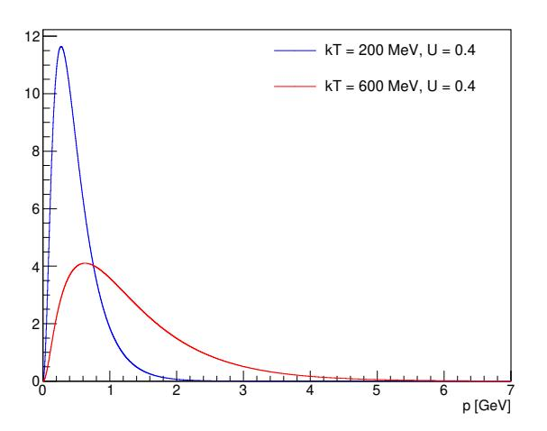

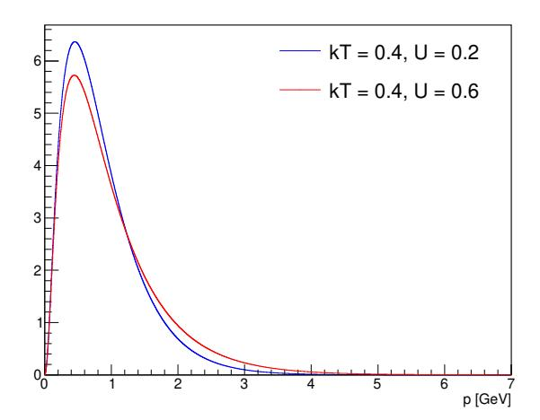

Figure 1: The momentum distributions obtained from the theory predictions compared for 2 different temperatures (left) and for 2 different velocities at temperature kT = 400 MeV (right).

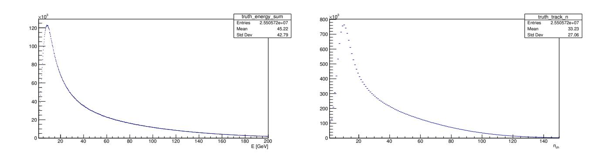

Figure 2: Distributions of the sum of energies of all particles in an event (left) and of particle multiplicity (right).

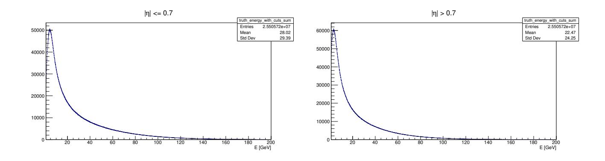

Figure 3: Sum of energies of all particles in an event for tracks in central region (left) and in forward region (right).

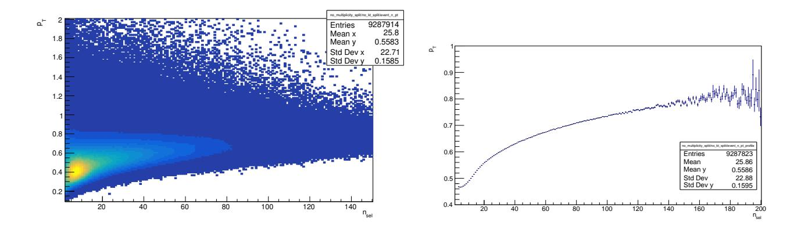

Figure 4: Average pT of tracks in an event as a function of number of charged particles in event. 2D histogram (left) profile histogram (right).

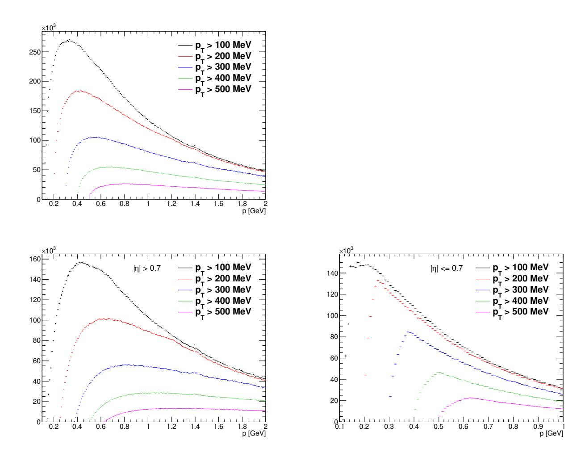

Figure 5: The momentum distributions for different  $p_T$  cuts shown for all tracks, central region and forward region. One can see, that in forward and therefore also in general region,  $p_T$  cut of 200 MeV changes the shape of the momentum distribution up to 1.2 GeV. Similarly for  $p_T$  cut of 300 MeV the momentum distribution shape is changed up to 1.8 GeV. One can assume that  $p_T$  cut of 100 MeV changes the momentum distribution up to 600 MeV. For the central region, the effect is much weaker. One can see that each  $p_T$  cut changes the momentum distribution up to 1.25 times its value. It means, that  $p_T$  cut of 100 MeV changes the momentum distribution up to 125 MeV. Therefore when fitting momentum distributions in forward all general region, fit for p < 600 MeV is not feasible.

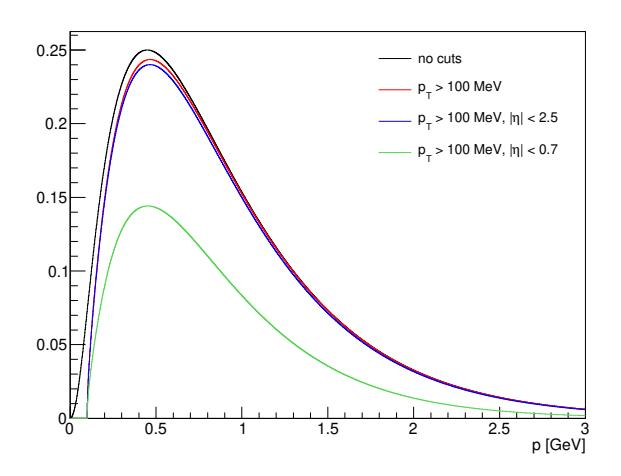

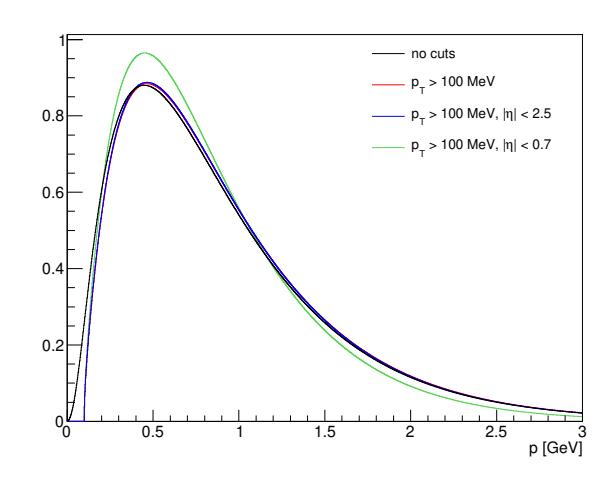

Figure 6: The momentum distributions obtained from the theory predictions compared for different  $p_T$  and  $|\eta|$  cuts unscaled (left) and scaled to the same integral (right).

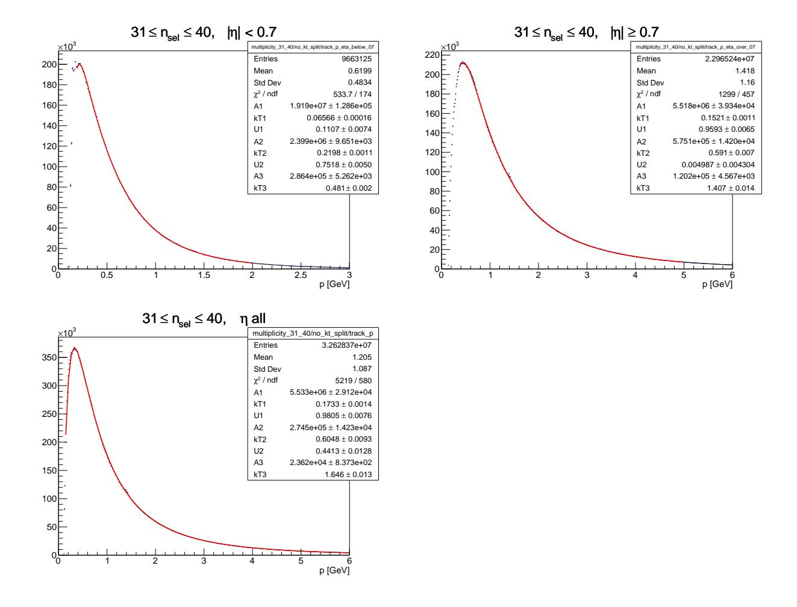

Figure 7: The momentum distribution for particular multiplicity interval in the various regions of pseudorapidity fitted with function assuming 2 moving and 1 static systems in the range of 120 (350) MeV ≤ p ≤ 2000 (5000) MeV. All parameters of the fit are shown in the plots.

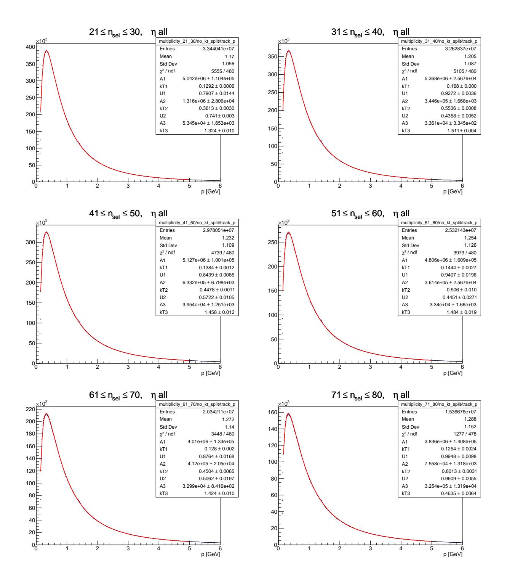

Figure 8: The momentum distribution for various multiplicity intervals in the whole region of pseudorapidity fitted with function assuming 2 moving and 1 static systems in the range of 120 MeV ≤ p ≤ 5000 MeV. All parameters of the fit are shown in the plots.

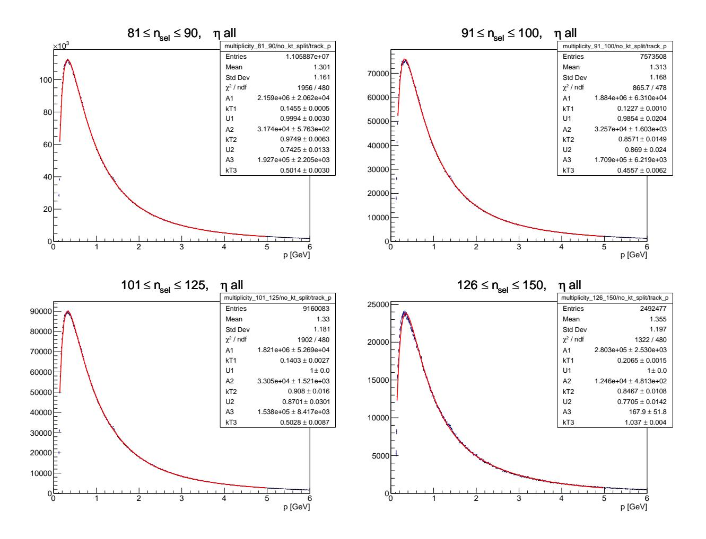

Figure 9: The momentum distribution for various multiplicity intervals in the whole region of pseudorapidity fitted with function assuming 2 moving and 1 static systems in the range of 120 MeV ≤ p ≤ 5000 MeV. All parameters of the fit are shown in the plots.

| nsel    | U1    | kT1 [MeV] | U2    | kT2 [MeV] | kT3 [MeV] |
|---------|-------|--------------|-------|--------------|--------------|
| 21–30   | 0.791 | 129          | 0.741 | 361          | 1324         |
| 31–40   | 0.927 | 168          | 0.436 | 554          | 1511         |
| 41–50   | 0.844 | 138          | 0.572 | 448          | 1458         |
| 51–60   | 0.941 | 144          | 0.445 | 506          | 1484         |
| 61–70   | 0.876 | 128          | 0.506 | 450          | 1424         |
| 71–80   | 0.995 | 125          | 0.961 | 801          | 464          |
| 81–90   | 0.999 | 146          | 0.743 | 975          | 501          |
| 91–100  | 0.985 | 123          | 0.869 | 857          | 456          |
| 101–125 | 1.000 | 140          | 0.870 | 908          | 503          |
| 126–150 | 1.000 | 207          | 0.771 | 847          | 1037         |

Table 1: Results of the momentum distributions fits by 3 temperatures (2 systems are considered boosted and one static) at 13 TeV for different multiplicity intervals. Values for intervals of small multiplicity are similar to each other, while for high multiplicity, the values are different.